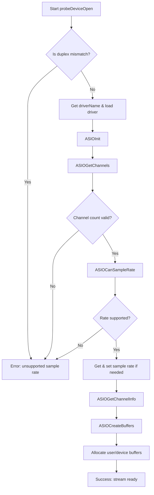

# Audio I/O and Backend Configuration: Device Probing and Sample Rate Handling

This section describes how the application probes ASIO devices, validates channel and sample-rate requirements, and prepares buffers for real-time audio I/O. It lives within the PortAudio/RtAudio ASIO bindings under the project’s third-party sources.

## Purpose and Context

Device probing ensures that the chosen ASIO driver can satisfy the requested audio configuration before opening a stream. This prevents runtime failures and enforces consistency for duplex (input+output) streams across the application.

## probeDeviceOpen Function Overview

The core entry point is the `RtApiAsio::probeDeviceOpen` method. It performs:

- **Driver selection** and **initialization**
- **Channel count** and **offset validation**
- **Sample rate** support checking and setting
- **Buffer allocation** for both device and user data

```cpp
bool RtApiAsio::probeDeviceOpen(
  unsigned int device,
  StreamMode   mode,
  unsigned int channels,
  unsigned int firstChannel,
  unsigned int sampleRate,
  RtAudioFormat format,
  unsigned int *bufferSize,
  RtAudio::StreamOptions *options
);
```

| Parameter | Description |
| --- | --- |
| `device` | Index of the ASIO driver |
| `mode` | `OUTPUT`, `INPUT`, or `DUPLEX` |
| `channels` | Number of channels requested |
| `firstChannel` | Zero-based offset into the device’s channel set |
| `sampleRate` | Desired sample rate (Hz) |
| `format` | Data format (e.g., 32-bit float) |
| `bufferSize` | Frames per buffer (input and output share this) |
| `options` | Stream options (e.g., latency hints) |


## Driver Loading and Initialization 🚀

> Parameters explained in the table below.

1. **Duplex enforcement**
2. If an input stream follows an output stream, it must use the same device ID.
3. Otherwise, an error is returned.
4. **Driver name retrieval**

```cpp
   ASIOError result = drivers.asioGetDriverName((int)device, driverName, 32);
```

1. **One-time loading per duplex**
2. Calls `drivers.loadDriver(driverName)`
3. Invokes `ASIOInit(&driverInfo)` to initialize the driver

## Channel Count Validation

After initialization:

```cpp
long inputChannels, outputChannels;
result = ASIOGetChannels(&inputChannels, &outputChannels);
```

- Checks success; otherwise unloads driver and fails.
- Verifies `(channels + firstChannel) ≤ availableChannels` for the given mode.
- Stores valid counts in `stream_.nDeviceChannels` and `stream_.nUserChannels`.

## Sample Rate Verification and Setting 🔄

1. **Support check**

```cpp
   result = ASIOCanSampleRate((ASIOSampleRate) sampleRate);
```

- Fails if the driver doesn’t advertise support.
- **Current vs. requested rate**

```cpp
   ASIOSampleRate currentRate;
   ASIOGetSampleRate(&currentRate);
```

1. **Conditional rate change**
2. Only calls `ASIOSetSampleRate` if `currentRate != sampleRate`.
3. Unloads driver on failure.

## Buffer Creation and Stream Setup

Once channels and rates are valid:

1. **Determine data type** via `ASIOGetChannelInfo`.
2. **Configure ASIO callback structure** (`bufferSwitch`, `sampleRateDidChange`, `asioMessage`).
3. **Create device buffers**

```cpp
   ASIOCreateBuffers(handle->bufferInfos, nChannels, stream_.bufferSize, &asioCallbacks);
```

1. **Allocate user and device buffers** based on:
2. `stream_.nUserChannels`
3. `formatBytes(stream_.userFormat)`
4. `*bufferSize`

## Error Handling and Duplex Constraints ⚠️

- **Misconfiguration** (e.g., too many channels, unsupported rate) immediately aborts with a descriptive message.
- Duplex streams must reuse the same driver, ensuring synchronized input/output.
- On any ASIO API error, the driver is unloaded to avoid resource leaks.

```card
{
    "title": "Key Takeaway",
    "content": "probeDeviceOpen prevents invalid ASIO configurations by validating drivers, channels, and sample rates before opening streams."
}
```

## Process Flowchart



## Interaction with the Broader System

- Invoked by `RtApi::openStream` when an ASIO backend is selected.
- Fills the shared `RtApiStream` structure with device handles and buffer parameters.
- Subsequent calls to `startStream` and `callbackEvent` rely on this setup for real-time audio scheduling.

---

This detailed documentation should guide developers through the ASIO device probing logic, illustrating how **probeDeviceOpen** ensures robust, error-free audio stream configuration.