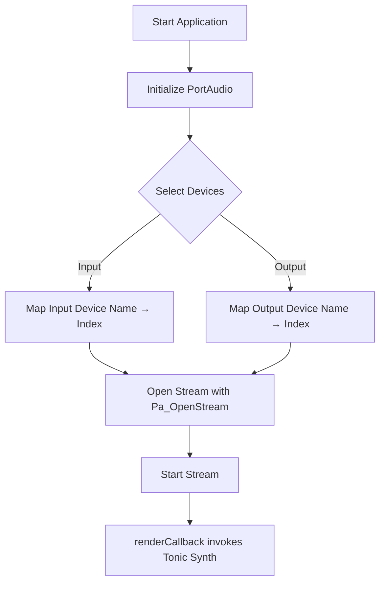

# Audio I/O and Backend Configuration – PortAudio Integration and ASIO/DirectSound Backends

This section describes how the application handles real-time audio I/O using PortAudio, and how ASIO and DirectSound backends are enabled and configured at both build time and runtime. It covers initialization, stream setup, callback handling, preprocessor defines, library dependencies, and runtime device selection.

## PortAudio Integration

PortAudio provides a cross-platform API for low-latency audio I/O. The application uses it as the core audio engine.

### Initialization

Before any audio operations, PortAudio must be initialized:

```cpp
// In spitoniccontrolswitchersynthvoroguiwin32.cpp
global_err = Pa_Initialize();
if (global_err != paNoError) {
    // Log or display error and exit
    return 1;
}
```

- **Pa_Initialize()** boots the PortAudio engine.
- Errors are checked against `paNoError`.

### Device Selection

Two helper functions enumerate and select devices by name:

- `SelectAudioInputDevice()`
- `SelectAudioOutputDevice()`

They:

- Call `Pa_GetDeviceCount()` and `Pa_GetDeviceInfo()` to list devices.
- Map device **name → index** in `global_inputdevicemap` and `global_outputdevicemap`.
- Look up `global_audioinputdevicename` / `global_audiooutputdevicename`.
- Fall back to default if not found.
- Populate `PaStreamParameters` structures.

### Opening the Stream

Once parameters are set, the stream is opened:

```cpp
global_err = Pa_OpenStream(
    &global_stream,
    &global_inputParameters,
    &global_outputParameters,
    SAMPLE_RATE,
    FRAMES_PER_BUFFER,
    0,              // flags (e.g. paClipOff)
    renderCallback, // user callback
    NULL            // userData
);
if (global_err != paNoError) {
    // Handle open-stream error
}
```

- Uses **full-duplex** mode: input + output.
- Frames per buffer and sample rate defined in project constants.
- `renderCallback` fills output audio via Tonic synth.

### Callback Processing

The audio callback runs in real time:

```cpp
static int renderCallback(
    const void* inputBuffer,
    void*       outputBuffer,
    unsigned long framesPerBuffer,
    const PaStreamCallbackTimeInfo* timeInfo,
    PaStreamCallbackFlags statusFlags,
    void* userData
) {
    SAMPLE* out = (SAMPLE*)outputBuffer;
    // Synthesize or pass-through samples
    global_pSynth->fillBufferOfFloats(
        (float*)outputBuffer,
        framesPerBuffer,
        NUM_CHANNELS
    );
    return paContinue;
}
```

- Called at the audio interrupt level; avoid malloc/free.
- Fills `outputBuffer` with stereo float audio.

---

## Backend Configuration

ASIO and DirectSound support is toggled at compile time using preprocessor defines. Depending on the platform (Win32 vs x64) and build configuration, different PortAudio binaries and system libraries are linked.

### ASIO Backend

- **Define:** `PA_USE_ASIO=1`
- **Header:** `#include "pa_asio.h"`
- Enables ASIO driver support within PortAudio.
- Requires the ASIO SDK and matching PortAudio ASIO binaries.

### DirectSound Backend

- **Define:** `__WINDOWS_DS__`
- Links against **Dsound.lib** and **winmm.lib**.
- Implements the Windows DirectSound API path in PortAudio’s codebase.

---

## Build Configuration

The Visual Studio project sets up include paths, preprocessor definitions, and library dependencies for each configuration and platform.

### Preprocessor Definitions

| Define | Purpose |
| --- | --- |
| **PA_USE_ASIO** | Enables ASIO driver path in PortAudio |
|  | Enables DirectSound driver support |


These appear under each `<ItemDefinitionGroup>` for both Win32 and x64 builds.

### Library Dependencies

|  | Platform & Config | PortAudio Library | Additional Audio Libraries |
| --- | --- | --- | --- |
| Debug | Win32 | `portaudio_x86.lib` | `Dsound.lib`, `winmm.lib` |
| Release | x64 | `portaudio_x64.lib` | `Dsound.lib`, `winmm.lib` |


Paths to these binaries are specified in `AdditionalDependencies`.

---

## Runtime Configuration

By default, the application targets a specific ASIO device (e.g., **"E-MU ASIO"**) but allows users to override this at launch.

### Default Device Names

```cpp
global_audioinputdevicename  = "E-MU ASIO";
global_audiooutputdevicename = "E-MU ASIO";
```

- Maps to the named ASIO device found in `SelectAudio…Device()`.

### Command-Line Override

Users can pass device names and channel selectors as command-line arguments:

```bash
app.exe "My ASIO Driver" 0 1 "My ASIO Driver" 0 1
```

- **Arg 1:** Input device name
- **Arg 2–3:** Left/right input channel indices
- **Arg 4:** Output device name
- **Arg 5–6:** Left/right output channel indices
- Falls back gracefully if arguments are missing.

```card
{
    "title": "Device Override",
    "content": "Override ASIO/DirectSound devices and channels at runtime without recompiling."
}
```

---

## Audio I/O Workflow



This diagram shows the sequence from startup to real-time audio processing.

---

By combining PortAudio’s flexible backend selection with ASIO and DirectSound paths, the application delivers low-latency audio on Windows while giving end users full control over their audio hardware.