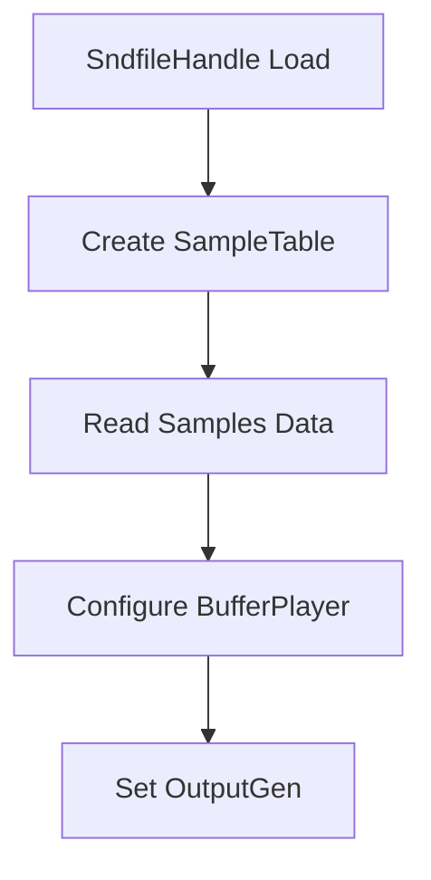

# Audio I/O and Backend Configuration – libsndfile and Sample-Based Playback

This section explains how the application integrates **libsndfile** for sample loading and configures the Visual Studio project to support buffer-based playback in various Tonic synth demos. You’ll learn:

- How **libsndfile** is included and linked
- Key classes and functions for sample playback
- Data flow from file to audio output
- Best practices and pitfalls

---

## libsndfile Integration 🔧

The project uses **libsndfile** to read standard audio formats (WAV, AIFF, FLAC) into memory buffers. Configuration is handled in the Visual Studio project:

```xml
<ItemDefinitionGroup Condition="'$(Configuration)|$(Platform)'=='Debug|Win32'">
  <ClCompile>
    <AdditionalIncludeDirectories>
      .\lib-src\libsndfile\include;
      …  
    </AdditionalIncludeDirectories>
  </ClCompile>
  <Link>
    <AdditionalDependencies>
      …;\lib-src\libsndfile\libsndfile-1.lib;…  
    </AdditionalDependencies>
  </Link>
</ItemDefinitionGroup>
```

- **Include directory**: `.\lib-src\libsndfile\include`
- **Library**: `libsndfile-1.lib` (Release/Debug, x86/x64)

These settings ensure the compiler finds `sndfile.hh` and the linker resolves `libsndfile` symbols.

---

## Sample-Based Playback Synths 🎶

Several **Tonic**-based synth demos load and play audio buffers via **libsndfile** and the Tonic `BufferPlayer`:

| Synth Class | Header File | Purpose |
| --- | --- | --- |
| **BufferPlayerExpSynth** | `BufferPlayerExpSynth.h` | Load two samples; trigger on BPM for layered playback |
| **SimpleStepSequencerBufferPlayerSynth** | `SimpleStepSequencerBufferPlayerSynth.h` | Step sequencer driving a single buffer player |
| **StepSequencerBufferPlayerExpSynth** | `StepSequencerBufferPlayerExpSynth.h` | Multi-step sequenced buffer playback |
| **FilterExpSynth** | `FilterExpSynth.h` | Load sample, apply filter and delay effects |
| **EventsExpBufferPlayerSynth** | `EventsExpBufferPlayerSynth.h` | Voice-based event scheduler with sample playback |


Each uses:

- `#include <sndfile.hh>`
- `SndfileHandle` to open and validate the file
- `SampleTable` to allocate a buffer of `frames × channels`
- `file.read(...)` to fill the buffer
- `BufferPlayer` to schedule playback, looping, and triggering

---

## Core Usage Example

```cpp
#include <sndfile.hh>
#include <Tonic.h>

using namespace Tonic;

SndfileHandle file("path/to/sample.wav");
assert(file.samplerate() == 44100);
assert(file.channels()   == 2);

SampleTable buffer(file.frames(), file.channels());
file.read(buffer.dataPointer(), file.frames() * file.channels());

BufferPlayer player;
player.setBuffer(buffer)
      .loop(false)
      .trigger(ControlMetro().bpm(120));

setOutputGen(player);
```

This snippet illustrates the typical pattern seen in sample-based synths .

---

## Data Flow Diagram

Visualizing the steps from file load to audio output:



- **A**: Open file and confirm sample rate & channels
- **B**: Allocate in-RAM buffer for frames × channels
- **C**: Copy raw samples into `SampleTable`
- **D**: Attach buffer to `BufferPlayer`, configure looping/triggers
- **E**: Hook into Tonic’s `setOutputGen` for real-time playback

---

## Best Practices 📋

```card
{
    "title": "Error Handling",
    "content": "Always assert `samplerate()` and `channels()` before reading buffer."
}
```

- **Use assertions** to catch unsupported sample rates or channel counts
- **Avoid hard-coded paths**; consider configurable file selectors
- **Match project config** for 32-bit vs. 64-bit builds to the correct `libsndfile` library
- **Keep buffer sizes reasonable** to prevent memory bloat

---

By following this setup, the application seamlessly integrates **libsndfile** for robust sample-based playback across multiple Tonic demos, while the Visual Studio project ensures correct include and link paths for all supported build configurations.