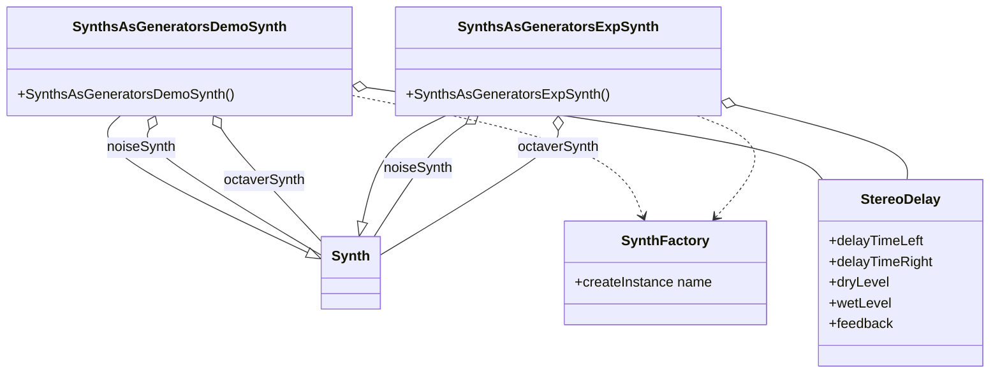

# Synthesizer Demo Suite (Tonic-based Synths) – Composite Synths and Meta-Control: SynthsAsGenerators 🤖

This section describes two **meta-synths**—`SynthsAsGeneratorsDemoSynth` and `SynthsAsGeneratorsExpSynth`—that combine multiple Tonic synths into a single, highly-controllable generator. These composite synths instantiate child synths dynamically, aggregate their parameters, apply global effects, and expose everything as one meta-synth for easy integration with the Vorogui controller.

## Key Components

- **SynthFactory**

Creates synth instances by name at runtime.

- **addParametersFromSynth**

Imports all control parameters from a child synth into the meta-synth.

- **StereoDelay**

A stereo delay effect applied to the combined signal.

- **TONIC_REGISTER_SYNTH**

Macro that registers a synth class under a given name for `SynthFactory`.

## Class Overview



## SynthsAsGeneratorsDemoSynth

`SynthsAsGeneratorsDemoSynth` aggregates two existing demo synths, applies delay, and scales the result.

```cpp
class SynthsAsGeneratorsDemoSynth : public Synth {
public:
  SynthsAsGeneratorsDemoSynth(){
    // Instantiate child synths
    Synth noiseSynth = SynthFactory::createInstance("FilteredNoiseSynth");
    Synth octaverSynth = SynthFactory::createInstance("ControlSnapToScaleTestSynth");

    // Aggregate their controls into this meta-synth
    addParametersFromSynth(noiseSynth);
    addParametersFromSynth(octaverSynth);

    // Configure a stereo delay
    StereoDelay delay = StereoDelay(0.5f, 0.5f)
      .delayTimeLeft(0.2)
      .delayTimeRight(0.3)
      .dryLevel(1.0f)
      .wetLevel(0.8f)
      .feedback(0.3);

    // Combine, process, and scale
    setOutputGen(((noiseSynth * 0.5 + octaverSynth) >> delay) * 0.8);
  }
};
TONIC_REGISTER_SYNTH(SynthsAsGeneratorsDemoSynth);
```

## SynthsAsGeneratorsExpSynth

`SynthsAsGeneratorsExpSynth` follows the same pattern, substituting an experimental snap-to-scale synth.

```cpp
class SynthsAsGeneratorsExpSynth : public Synth {
public:
  SynthsAsGeneratorsExpSynth(){
    Synth noiseSynth = SynthFactory::createInstance("FilteredNoiseSynth");
    Synth octaverSynth = SynthFactory::createInstance("ControlSnapToScaleExpSynth");

    addParametersFromSynth(noiseSynth);
    addParametersFromSynth(octaverSynth);

    StereoDelay delay = StereoDelay(0.5f, 0.5f)
      .delayTimeLeft(0.2)
      .delayTimeRight(0.3)
      .dryLevel(1.0f)
      .wetLevel(0.8f)
      .feedback(0.3);

    setOutputGen(((noiseSynth * 0.5 + octaverSynth) >> delay) * 0.8);
  }
};
TONIC_REGISTER_SYNTH(SynthsAsGeneratorsExpSynth);
```

## Composite Synths at a Glance

| Composite Synth | Child Synths | Delay Settings | Output Scale |
| --- | --- | --- | --- |
| **Demo** – `SynthsAsGeneratorsDemoSynth` | FilteredNoiseSynth<br/>ControlSnapToScaleTestSynth | left = 0.2, right = 0.3, dry = 1.0, wet = 0.8, feedback = 0.3 | 0.8 |
| **Experimental** – `SynthsAsGeneratorsExpSynth` | FilteredNoiseSynth<br/>ControlSnapToScaleExpSynth | same as demo | 0.8 |


## How Meta-Control Works

1. **Dynamic Instantiation**

Child synths are created via

```cpp
   SynthFactory::createInstance("SynthName");
```

1. **Parameter Aggregation**

Calling

```cpp
   addParametersFromSynth(childSynth);
```

pulls every `ControlParameter` and `ControlGenerator` from the child synth into the parent’s GUI and automation interface.

1. **Global Effects Chain**

The summed output of child synths is routed through `StereoDelay`

and then globally scaled before being assigned to `setOutputGen(...)`.

## Integration with Vorogui

- **Control Points**

Each aggregated parameter appears as a point in the Voronoi-based GUI.

- **Massive Meta-Control**

Hundreds of knobs from child synths become manipulable vertices, enabling rich, spatial audio control.

- **Runtime Flexibility**

Developers can swap child synth names in `SynthFactory::createInstance` to prototype new combinations without recompiling GUI code.

```card
{
    "title": "Meta-Control Tip",
    "content": "Always call addParametersFromSynth for all child synths before setting the output generator to ensure full parameter exposure."
}
```

---

By leveraging `**SynthFactory**`, `**addParametersFromSynth**`, and `**StereoDelay**`, these composite synths provide a powerful **meta-control** layer. They serve as templates for building complex, modular synthesizers that integrate seamlessly with the Vorogui interface for interactive, real-time audio manipulation.