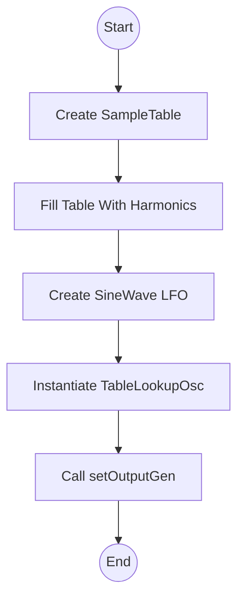

# Synthesizer Demo Suite (Tonic-based Synths)

This section of the project showcases a **suite of synthesizer demos** built with the [Tonic](https://github.com/TonicAudio/Tonic) C++ library. Each demo is implemented as a subclass of `Tonic::Synth` and registered via `TONIC_REGISTER_SYNTH`, making it selectable in the application’s graphical controller (Vorogui). The suite illustrates a variety of synthesis techniques—from simple waveforms to sample-based and table-lookup oscillators.

---

## 🎛️ Example: ArbitraryTableLookupSynth

The `ArbitraryTableLookupSynth` demonstrates **custom wavetable synthesis**. It builds a user-defined lookup table, fills it with a sum of harmonically related sine waves, and reads it back with a `TableLookupOsc` whose frequency is subtly modulated. This example focuses on the mechanics of table-based synthesis rather than user controls.

### Purpose and Overview

- Showcase creation and use of an **arbitrary-length wavetable**.
- Illustrate **frequency modulation** of a table-lookup oscillator.
- Provide a minimal example without ControlParameters (no Vorogui sliders).

### Key Components

| Component | Description |
| --- | --- |
| SampleTable | Holds raw waveform data; constructed with a length parameter (`tablesize`) . |
| TableLookupOsc | Oscillator that reads from a `SampleTable`; auto-resizes to a power-of-two+1 internally. |
| SineWave | Generates a sine LFO for pitch modulation. |
| setOutputGen(...) | Defines the synth’s audio output generator chain. |


### Implementation Details

1. **Define table size**

A non-power-of-two size (`2500`) is chosen to demonstrate Tonic’s auto-resizing.

1. **Build the **`**SampleTable**`

```cpp
   const unsigned int tablesize = 2500;
   SampleTable lookupTable = SampleTable(tablesize, 1);
   TonicFloat norm = 1.0f / tablesize;
   TonicFloat* tableData = lookupTable.dataPointer();
```

1. **Fill with harmonics**

Sum three sine waves (1st, 2nd, 5th harmonics) with weights 0.75, 0.5, 0.25:

```cpp
   for (unsigned int i = 0; i < tablesize; i++) {
     TonicFloat phase = TWO_PI * i * norm;
     *tableData++ = 0.75f * sinf(phase)
                  + 0.5f  * sinf(phase * 2)
                  + 0.25f * sinf(phase * 5);
   }
```

1. **Create frequency-modulated oscillator**

```cpp
   auto osc = TableLookupOsc()
                .setLookupTable(lookupTable)
                .freq(100 + 40 * SineWave().freq(5)); // LFO at 5 Hz
```

1. **Set output generator**

```cpp
   setOutputGen(osc * 0.5); // 50% amplitude scaling
```

### Code Example

```cpp
// ArbitraryTableLookupSynth.h
#include "Tonic.h"
using namespace Tonic;

class ArbitraryTableLookupSynth : public Synth {
public:
  ArbitraryTableLookupSynth() {
    const unsigned int tablesize = 2500;
    SampleTable lookupTable = SampleTable(tablesize, 1);
    TonicFloat norm = 1.0f / tablesize;
    TonicFloat* tableData = lookupTable.dataPointer();

    for (unsigned int i = 0; i < tablesize; i++) {
      TonicFloat phase = TWO_PI * i * norm;
      *tableData++ = 0.75f * sinf(phase)
                   + 0.5f  * sinf(phase * 2)
                   + 0.25f * sinf(phase * 5);
    }

    auto osc = TableLookupOsc()
                 .setLookupTable(lookupTable)
                 .freq(100 + 40 * SineWave().freq(5));

    setOutputGen(osc * 0.5);
  }
};

TONIC_REGISTER_SYNTH(ArbitraryTableLookupSynth);
```

*Defined in* `ArbitraryTableLookupSynth.h` .

### Execution Flow



### Integration with the Demo Suite

- **Registration**: The `TONIC_REGISTER_SYNTH` macro adds this synth to the suite’s factory.
- **Selection**: The main application includes this header among many in `SynthDemoSuite` (`main.cpp` or equivalent) .
- **Vorogui**: Any `ControlParameter`s added here would appear as GUI controls; this synth has none.

### Dependencies

- **Tonic**: Core synthesis classes (`SampleTable`, `TableLookupOsc`, `SineWave`) .
- **PortAudio/ASIO**: Real-time audio I/O handled by the application layer.
- **FreeImage & libsndfile**: Media support elsewhere in the project.

### Further Customization

- **Table Size**: Change `tablesize` (e.g., 2049) for perceptual comparison.
- **Harmonic Content**: Adjust weights or add sine terms for new timbres.
- **Modulation Rate**: Vary the LFO frequency to explore vibrato effects.

```card
{
    "title": "Customization Tip",
    "content": "Experiment with different `tablesize` values and harmonic sums to sculpt unique sounds."
}
```