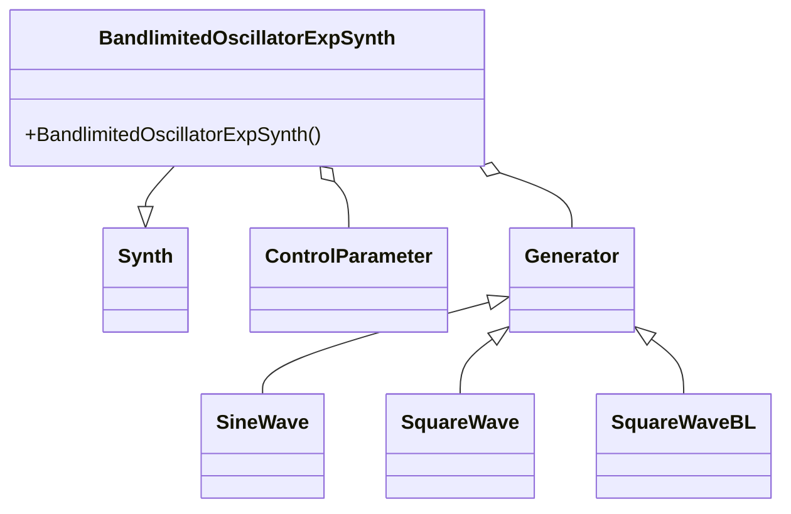

# Synthesizer Demo Suite (Tonic-based Synths)

The Synthesizer Demo Suite showcases a collection of standalone synths built with the Tonic library. Each demo illustrates a unique synthesis technique, exposing real-time parameters that Vorogui can control via a Voronoi-based interface. These synths integrate seamlessly into the Win32 host for audio I/O and graphical control.

---

## BandlimitedOscillatorExpSynth

BandlimitedOscillatorExpSynth morphs between a naive square wave and a band-limited square wave in real time. It uses a low-frequency sine to sweep the oscillator’s pitch and a smoothed crossfade parameter to minimize zipper noise. Vorogui exposes the **blend** parameter for interactive control of spectral brightness and aliasing.

---

## Parameters

| Name | Default | Range | Description |
| --- | --- | --- | --- |
| blend | 0.5 | 0.0 – 1.0 | Crossfades between naive square and bandlimited square |


---

## Signal Flow 🎛️

- **freqSweep**

A pitch modulator: `SineWave().freq(5) * 50 + 100`

Sweeps oscillator between 50 Hz and 150 Hz at 5 Hz rate.

- **smoothBlend**

`blend.smoothed(.05)`

Applies a 50 ms smoothing window to reduce zipper noise.

- **output**

Linear mix:

`(SquareWave().freq(80) * (1.0 - smoothBlend)) + (SquareWaveBL().freq(freqSweep) * smoothBlend)`

- **Amplitude Scaling**

Final level: `output * 0.25`

---

## Code Example

```cpp
#include "Tonic.h"
using namespace Tonic;

class BandlimitedOscillatorExpSynth : public Synth {
public:
  BandlimitedOscillatorExpSynth() {
    // 1. Create a blend control parameter
    ControlParameter blend = addParameter("blend", 0.5f).min(0).max(1);

    // 2. Define a frequency sweep generator
    Generator freqSweep = SineWave().freq(5) * 50 + 100;

    // 3. Smooth the blend parameter to avoid zipper noise
    Generator smoothBlend = blend.smoothed(.05);

    // 4. Crossfade between naive and bandlimited square waves
    Generator output = (SquareWave().freq(80) * (1.0 - smoothBlend))
                     + (SquareWaveBL().freq(freqSweep) * smoothBlend);

    // 5. Set the synth’s audio output (scaled down)
    setOutputGen(output * 0.25);
  }
};
//TONIC_REGISTER_SYNTH(BandlimitedOscillatorExpSynth);
```

---

## Integration with Vorogui

Vorogui queries each synth’s parameters and maps them to control points in a Voronoi diagram. For example, the host does:

```cpp
vector<ControlParameter> params = global_pSynth->getParameters();
for (auto& p : params) {
  float min   = p.getMin();
  float max   = p.getMax();
  float value = p.getValue();
  string name = p.getName();
  // Vorogui uses these values to place and label points...
}
```

---

## Class Diagram



---

## Dependencies

- **Tonic** (`Tonic.h`) for core synthesis classes
- **PortAudio / ASIO** for real-time audio I/O
- **Vorogui** (`c_vorogui.h` / `c_pointset.h`) for graphical control
- **SquareWaveBL** for alias-free waveform generation

---

```card
{
    "title": "Smooth Parameter Changes",
    "content": "Use .smoothed(time) to reduce zipper noise when automating parameters."
}
```