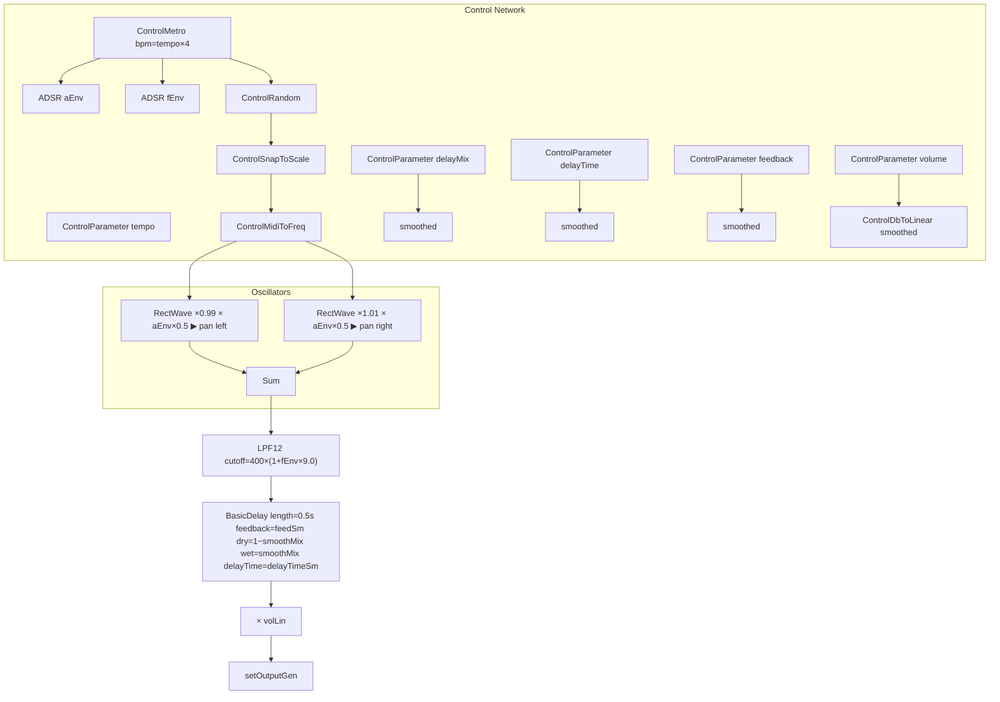

# Synthesizer Demo Suite (Tonic-based Synths)

The **Synthesizer Demo Suite** bundles a variety of Tonic-powered synth examples. Each demo showcases different synthesis techniques, from simple oscillators to complex effects chains. These synths integrate seamlessly with the Vorogui controller for real-time parameter tweaking.

## DelayTestSynth 🔁

**DelayTestSynth** implements a tempo-synced delay effect driven by rectangular oscillators. It uses ADSR envelopes for amplitude and filter modulation, a 12 dB/octave low-pass filter, and a basic delay line. Users can tweak six parameters to sculpt rhythmic echoes.

### Parameters

Control points exposed via Vorogui:

| Name | Display Name | Default | Range | Scaling | Description |
| --- | --- | --- | --- | --- | --- |
| tempo | Tempo | 120 BPM | 60 – 300 BPM | Linear | Base BPM for delay sync |
| delayTime | Delay Time | 0.12 s | 0.001 – 1.0 s | Logarithmic | Delay tap time |
| feedback | Delay Feedback | 0.4 | 0.0 – 0.95 | Linear | Delay regeneration amount |
| delayMix | Delay Dry/Wet | 0.3 | 0.0 – 1.0 | Linear | Balance between dry and wet signals |
| decayTime | Env Decay Time | 0.08 s | 0.05 – 0.25 s | Logarithmic | ADSR decay for envelopes |
| volume | Volume (dbFS) | 0 dB | −60 – 0 dBFS | Linear | Output gain in decibels |


All parameters use `addParameter` in the constructor to register with Tonic and Vorogui .

### Audio Signal Chain

Below is a high-level flow of audio and control signals:



### Implementation Details

- **Control Parameters**

Registers six synth parameters for interactive tweaking .

- **Tempo-Synced Trigger**

`ControlMetro` runs at `tempo×4` beats, driving both amplitude (`aEnv`) and filter (`fEnv`) envelopes.

- **Stereo Oscillators**

Two `RectWave` generators detuned by ±1% around a quantized pitch stream. Each voice is panned (`MonoToStereoPanner`) for stereo width.

- **Envelopes**
- `aEnv`: Shapes oscillator amplitude
- `fEnv`: Modulates `LPF12` cutoff

- **Pitch Generation**

Random MIDI notes (0–36) snap to a pentatonic scale and convert to frequency via `ControlMidiToFreq`.

- **Filtering**

`LPF12` applies a 12 dB/octave low-pass filter, cutoff driven by `fEnv`.

- **Delay Effect**

`BasicDelay` uses smoothed `delayTime` and `delayMix` to ensure glitch-free transitions. Feedback is also smoothed.

- **Output Scaling**

A `ControlDbToLinear` block converts dB gain to linear scale, smoothing `volume` changes, then assigns the final generator via `setOutputGen`.

### Code Snippet

```cpp
DelayTestSynth(){
  auto tempo     = addParameter("tempo", 120.f)
                     .displayName("Tempo")
                     .min(60.f).max(300.f);
  auto delayTime = addParameter("delayTime", 0.12f)
                     .displayName("Delay Time")
                     .min(0.001f).max(1.0f).logarithmic(true);
  auto feedBack  = addParameter("feedback", 0.4f)
                     .displayName("Delay Feedback")
                     .min(0.0f).max(0.95f);
  auto delayMix  = addParameter("delayMix", 0.3f)
                     .displayName("Delay Dry/Wet")
                     .min(0.0f).max(1.0f);
  auto decay     = addParameter("decayTime", 0.08f)
                     .displayName("Env Decay Time")
                     .min(0.05f).max(0.25f).logarithmic(true);
  auto volume    = addParameter("volume", 0.f)
                     .displayName("Volume (dbFS)")
                     .min(-60.f).max(0.f);

  auto metro = ControlMetro().bpm(tempo * 4);

  auto aEnv = ADSR().attack(0.005f).decay(decay)
                    .sustain(0.0f).release(0.01f)
                    .trigger(metro).exponential(true);
  auto fEnv = aEnv; // same envelope settings

  std::vector<float> scale = {0,3,5,7,10};
  auto rand = ControlRandom().min(0).max(36).trigger(metro);
  auto snap = ControlSnapToScale().setScale(scale).input(rand);
  auto freq = ControlMidiToFreq().input(48 + snap);

  Generator osc = ((RectWave().freq(freq*0.99).pwm(0.5f)*aEnv*0.5f)>>MonoToStereoPanner().pan(-0.5f))
                + ((RectWave().freq(freq*1.01).pwm(0.5f)*aEnv*0.5f)>>MonoToStereoPanner().pan( 0.5f));

  auto filt = LPF12().cutoff(400.f*(1+fEnv*9)).Q(1.1f);

  auto smoothMix   = delayMix.smoothed();
  auto delayEffect = BasicDelay(0.5f,1.0f)
                      .delayTime(delayTime.smoothed(0.5f))
                      .feedback(feedBack.smoothed())
                      .dryLevel(1.0f-smoothMix)
                      .wetLevel(smoothMix);

  setOutputGen((osc>>filt>>delayEffect)*ControlDbToLinear().input(volume).smoothed());
}
```

### Vorogui Integration

- Each `ControlParameter` registers a draggable point in the Vorogui interface.
- Real-time adjustments flow directly into the synth graph.

```card
{
    "title": "Smooth Parameter Changes",
    "content": "Use .smoothed() on delayTime and delayMix to avoid audio clicks during automation."
}
```

### Key Takeaways

- **Tempo-Sync**: `ControlMetro.bpm(tempo×4)` aligns envelopes to musical timing.
- **Dual Envelopes**: Separate ADSRs for amplitude and filter give expressive control.
- **Stereo Width**: Detuned oscillators panned left/right add spatial depth.
- **Smoothing**: `.smoothed()` prevents artifacts on delay and volume parameters.
- **Vorogui Control**: All parameters expose intuitive GUI handles for live tweaking.