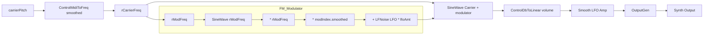

# Synthesizer Demo Suite (Tonic-based Synths)

The **Synthesizer Demo Suite** showcases a collection of Tonic-powered synthesizer examples. Each demo is a subclass of `Synth` that builds a small DSP graph via Tonic’s fluent API. Parameters exposed by these synths integrate directly with the Vorogui Voronoi controller, enabling real-time, graphical morphing of sound textures.

## 🎛️ Example: FMDroneExpSynth

An **extended FM drone synthesizer**, `FMDroneExpSynth` crafts slowly evolving, ambient textures using frequency modulation and layered LFOs. It derives from a Tonic demo by Nick Donaldson and adds custom parameter ranges and modulation depth for rich drone sounds.

### Purpose

`FMDroneExpSynth` generates:

- **Long-form, evolving drones** for ambient soundscapes.
- Interactive morphing of FM parameters via the Vorogui interface.
- A demonstration of chaining Tonic control and generator objects.

### Dependencies

| Header / Macro | Role |
| --- | --- |
| `#include "Tonic.h"` | Core Tonic DSP classes and factory macros. |
| `using namespace Tonic;` | Simplifies access to Tonic types. |
| `TONIC_REGISTER_SYNTH` | Registers the synth for `SynthFactory`. |


### Integration in Application

In the main application setup, the active synth is chosen and instantiated:

```cpp
// Select the FMDroneExpSynth for playback
global_pSynth = new(FMDroneExpSynth);
Tonic::setSampleRate(SAMPLE_RATE);
```

This allocation slot is one among many in `main.cpp`, enabling quick swapping of demos .

### Key Parameters

| Name | Range | Default | Description |
| --- | --- | --- | --- |
| **volume** | –60 dB to 0 dBFS | 0 dB | Output gain, converted to linear. |
| **carrierPitch** | MIDI 20 to 32 | 28 | Base pitch of the carrier oscillator. |
| **modIndex** | 0.0 to 1.0 | 0.25 | FM modulation depth. |
| **lfoAmt** | 0.0 to 1.0 | 0.5 | Amount of slow LFO on FM amount. |


 .

### DSP Graph

1. **Carrier Frequency**

`carrierPitch` → `ControlMidiToFreq().smoothed()` → 

1. **Modulator Frequency**

rCarrierFreq × 4 → 

1. **FM Modulator**

SineWave@rModFreq × rModFreq × modIndex × (1 + LFNoise LFO × lfoAmt)

1. **Carrier Oscillator**

SineWave@[rCarrierFreq + modulator]

1. **Amplitude Shaping**

• Convert `volume` dB to linear & smooth

• Multiply by slow amplitude LFO: `(SineWave@0.15 Hz + 1) * 0.75 + 0.25`

1. **Output**

`setOutputGen(outputGen)`

```cpp
Generator rCarrierFreq = ControlMidiToFreq()
  .input(carrierPitch)
  .smoothed();

Generator rModFreq = rCarrierFreq * 4.0f;

Generator outputGen =
  SineWave().freq(
    rCarrierFreq +
    ( SineWave().freq(rModFreq)
      * rModFreq
      * (modIndex.smoothed()
         * (1.0f
            + SineWave().freq(
                (LFNoise().setFreq(0.5f) + 1.f) * 2.f + 0.2f
              )
              * (lfoAmt * 0.5f).smoothed()
           )
        )
     )
  )
  >> ControlDbToLinear().input(volume).smoothed()
  * ((SineWave().freq(0.15f) + 1.f) * 0.75f + 0.25f);

setOutputGen(outputGen);
```

 .

### Audio Signal Flow



### Vorogui Integration

Parameters registered via `addParameter` appear as control points in the Vorogui interface. The `c_pointset.cpp` module reads `global_pSynth->getParameters()` to map each parameter to a Voronoi point, enabling click-and-drag morphing . Persisted point sets load from `{SynthName}.txt`, ensuring consistent GUI layouts across sessions.

### Design Patterns & Notes

- **Synth Subclassing**: Each demo implements a constructor-only DSP graph; no additional methods are required.
- **Fluent API**: Chaining of Tonic classes via `.` and operators (`*`, `>>`) creates readable signal chains.
- **Control Smoothing**: `.smoothed()` prevents audio artifacts on parameter changes.
- **Macro Registration**: `TONIC_REGISTER_SYNTH(FMDroneExpSynth)` binds the class to a string ID for dynamic instantiation.

This example illustrates Tonic’s flexibility in building expressive, interactive synth demos within a Win32 audio-visual application.