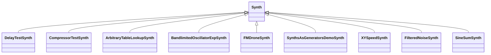

# Synthesizer Demo Suite (Tonic-based Synths)

This suite bundles a diverse collection of **Tonic::Synth** subclasses, each demonstrating different audio synthesis techniques. Every demo registers itself via **TONIC_REGISTER_SYNTH**, exposes adjustable **ControlParameter** fields, and defines its final audio output with **setOutputGen**. At runtime, these parameters are discoverable through **getParameters()** and mapped to Vorogui points for interactive control.

## 🎛️ Overview of Synth Collection

Below is a summary of the main synthesizer demos included in the project:

| Synth Class | Description | Demo Example Citation |
| --- | --- | --- |
| DelayTestSynth | Tempo‐synchronized delay with oscillator, ADSR and feedback control |  |
| CompressorTestSynth | Simple compressor test with threshold, ratio, attack/release toggles |  |
| ArbitraryTableLookupSynth | Custom waveform table lookup oscillator |  |
| BandlimitedOscillatorExpSynth | Blend between standard and bandlimited oscillators |  |
| FMDroneSynth / FMDroneExpSynth | Continuous FM drone with carrier, modulator, LFO controls |  |
| SynthsAsGeneratorsDemoSynth | Combines two sub‐synths through delay |  |
| SynthsAsGeneratorsExpSynth | Expanded version of synth‐as‐generator demo |  |
| XYSpeedSynth | X/Y speed‐controlled oscillator with filter and stereo delay |  |
| FilteredNoiseSynth | Pink noise filtered by controllable cutoff and Q |  |
| SineSumSynth | Additive synthesis of multiple sine waves |  |
| StepSequencerBufferPlayerEffectExpSynth | 8-step sequencer driving buffer playback with effects |  |
| … and many more | See project headers for full list |  |


## 🏷️ Synth Registration & Discovery

- Every demo subclass invokes the macro:

```cpp
  TONIC_REGISTER_SYNTH(ClassName);
```

- This registers it with the **SynthFactory**, enabling runtime instantiation by name.
- Example registration in **DelayTestSynth**:

```cpp
  class DelayTestSynth : public Synth { … };
  TONIC_REGISTER_SYNTH(DelayTestSynth);
```

## ⚙️ Common Construction Pattern

Each synthesizer constructor generally follows these steps:

- **Define ControlParameters** via `addParameter("name", defaultValue)`
- **Set displayName**, **min/max**, and optional **logarithmic** scaling
- **Wire together Tonic generators** (oscillators, envelopes, filters, delays, compressors, reverbs)
- **Combine generators** with arithmetic and `>>` (routing) operators
- Call **setOutputGen(...)** to finalize the audio output

**Example snippet from DelayTestSynth**:

```cpp
ControlParameter tempo     = addParameter("tempo", 120.f)
                               .displayName("Tempo")
                               .min(60.f)
                               .max(300.f);
ControlParameter delayTime = addParameter("delayTime", 0.12f)
                               .displayName("Delay Time")
                               .min(0.001f)
                               .max(1.0f)
                               .logarithmic(true);
// … more parameters …
BasicDelay delay = BasicDelay(0.5f, 1.0f)
                     .delayTime(delayTime.smoothed(0.5f))
                     .feedback(feedBack.smoothed())
                     .dryLevel(1.0f - smoothMix)
                     .wetLevel(smoothMix);
setOutputGen((osc >> filt >> delay) * volume.smoothed());
```

## 🔢 Runtime Parameter Exposure

- After instantiation, **getParameters()** returns a `vector<ControlParameter>` for that synth.
- Each **ControlParameter** exposes:
- **getName()**, **getValue()**, **getMin()**, **getMax()**
- Vorogui reads these and maps each parameter to a graphical point’s **control ratio**, enabling live manipulation.

## 🔗 Integration with Vorogui

- Vorogui’s point‐set builder calls:

```cpp
  vector<ControlParameter> params = global_pSynth->getParameters();
  for (auto& p : params) {
    float ratio = (p.getValue() - p.getMin())/(p.getMax() - p.getMin());
    // map ratio to point position…
  }
```

- Points around the GUI frame hold a **control ratio** of –1; synth parameters use [0…1] to reflect the current value.

## 🧩 Class Inheritance Diagram



## 🎚️ Discovering and Instantiating Synths

At startup, the application picks a synth via code like:

```cpp
global_pSynth = new DelayTestSynth();
// or
global_pSynth = SynthFactory::createInstance("FMDroneSynth");
```

Once created, **Vorogui** automatically builds its control points based on **getParameters()**, granting a unified interactive experience across all demos.

---

With this structure, developers can easily explore, extend, and interact with each Tonic‐powered demo, tapping into a rich palette of synthesis techniques within the Win32 audio-visual environment.