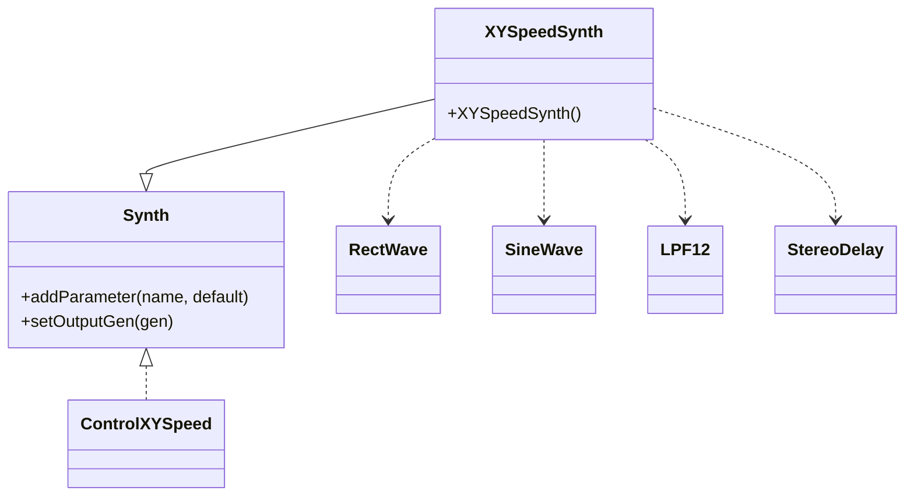
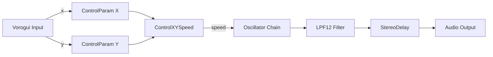

# Synthesizer Demo Suite (Tonic-based Synths) – Positional Control: XYSpeedSynth

The **XYSpeedSynth** demo showcases how 2D movement in the Vorogui graphical controller can drive an abstract “speed” control dimension in a Tonic-based synth. It maps normalized x/y positions to a scalar speed, which then modulates oscillators, PWM depth, and filter cutoff before routing through a stereo delay .

## Overview

This synth uses the `ControlXYSpeed` generator to compute a **speed** value from two `ControlParameter`s (`x` and `y`). It then:

- Drives oscillator frequencies
- Adjusts pulse-width modulation
- Tunes a low-pass filter cutoff
- Applies a stereo delay

This demonstrates how spatial gestures translate into timbral motion in real time.

## Class Structure 🎛️



## Audio Signal Chain 🎶

1. **Speed Generation**

```cpp
   Generator speed = ControlXYSpeed()
     .x(addParameter("x", 0.0f).min(0.0f).max(1.0f))
     .y(addParameter("y", 0.0f).min(0.0f).max(1.0f))
     .smoothed();
```

1. **Oscillators & Modulation**
2. *Rectangular Wave* freq = 100 + 20 × speed
3. *PWM Depth* = 0.05 + ( SineWave(0.1 Hz) + 1 ) × 0.2
4. *Sine Wave* freq = 1 + 20 × speed
5. **Filtering**

```cpp
   >> LPF12().cutoff(100 + 6000 * speed)
```

1. **Stereo Delay**

```cpp
   >> StereoDelay(0.1, 0.15).wetLevel(0.1)
```

1. **Output**

```cpp
   setOutputGen(outputGen);
```

## Parameter Table

| **Parameter** | **Range** | **Default** | **Description** |
| --- | --- | --- | --- |
| x | 0.0 – 1.0 | 0.0 | Horizontal position control |
| y | 0.0 – 1.0 | 0.0 | Vertical position control |


## Data Flow



## Core Code Example

```cpp
// XYSpeedSynth.h
#include "Tonic.h"
using namespace Tonic;

class XYSpeedSynth : public Synth {
public:
  XYSpeedSynth() {
    Generator speed = ControlXYSpeed()
      .x(addParameter("x", 0.0f).min(0.0f).max(1.0f))
      .y(addParameter("y", 0.0f).min(0.0f).max(1.0f))
      .smoothed();

    Generator outputGen = RectWave()
      .freq(100 + 20 * speed)
      .pwm(0.05 + (SineWave().freq(0.1) + 1) * 0.2)
      * SineWave().freq(1 + 20 * speed)
      >> LPF12().cutoff(100 + 6000 * speed)
      >> StereoDelay(0.1, 0.15).wetLevel(0.1);

    setOutputGen(outputGen);
  }
};
// Note: Registration macro can be enabled.
```

## Integration with Vorogui 🔗

> **Note:** `speed` is a derived, smoothed generator output, not a direct parameter.

In the main application, `XYSpeedSynth.h` is included and can be instantiated as the global synth. Vorogui reads its parameters via `getParameters()`, then maps each parameter’s normalized value to a Voronoi point’s **controlratio**, visually linking point positions to control values . When the user drags a point, `global_pSynth->setParameter()` updates `x` or `y`, altering the `speed` generator and thus the audio output.

```cpp
// Main includes... 
#include "XYSpeedSynth.h"
// ...
global_pSynth = new XYSpeedSynth();
// ...
POINTSET* pPOINTSET = VOROGUI_CreatePointset();
// Vorogui maps each ControlParameter value to controlratio[]
```

Parameter-to-point mapping snippet:

```cpp
vector<ControlParameter> params = global_pSynth->getParameters();
for (unsigned int i = 0; i < params.size(); i++) {
  TonicFloat min   = params[i].getMin();
  TonicFloat max   = params[i].getMax();
  TonicFloat value = params[i].getValue();
  // Normalize and assign to Vorogui point
  pPOINTSET->controlratio[offset + i] = (value - min) / (max - min);
}
```

## Dependencies & Relationships 📦

- **Tonic** (`Tonic.h`) for synthesis primitives
- **ControlXYSpeed** for 2D-to-scalar mapping
- **Generators**: `RectWave`, `SineWave`, `LPF12`, `StereoDelay`
- **Vorogui** (`c_pointset.cpp`, `c_vorogui.h`) for graphical control
- **PortAudio/ASIO**, **FreeImage**, **libsndfile** in the broader application

## Best Practice Note

```card
{
    "title": "Smoothing Controls",
    "content": "Use `.smoothed()` on ControlXYSpeed to prevent clicks from abrupt speed changes."
}
```

This section demonstrates a compact yet expressive way to convert 2D user gestures into dynamic timbral control, highlighting the power of Tonic’s generator chaining alongside Vorogui’s intuitive graphical mapping.