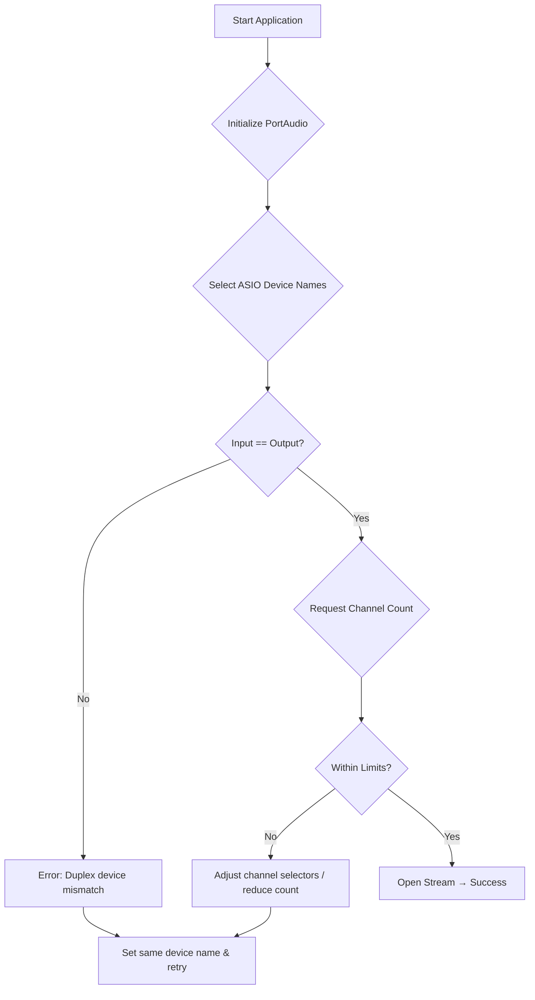

# Troubleshooting and Tips – Audio Device and ASIO Issues

When the application fails to start audio or produces no sound, it usually stems from ASIO device mismatches or unsupported stream configurations. This section guides you through common problems, their causes, and practical solutions.

## Common Symptoms

- **No audio output** after launching the app.
- **Stream open failure** with no obvious error dialog.
- **Logged error:** “an ASIO duplex stream must use the same device for input and output!”

## 1. Verify ASIO Device Names 🎯

Ensure you have a valid ASIO driver installed and that its name matches the defaults or the ones you pass on the command line.

### Checking Default and Command-Line Devices

On startup, the app reads device names from these globals:

```cpp
// Default names
global_audioinputdevicename  = "E-MU ASIO";
global_audiooutputdevicename = "E-MU ASIO";

// Override via command-line arguments
if (nArgs > 1) global_audioinputdevicename  = szArgList[1];
if (nArgs > 4) global_audiooutputdevicename = szArgList[4];
```

(See argument parsing in `main.cpp`)

### Code Snippet: Initialization Flow

```cpp
// Initialize PortAudio
global_err = Pa_Initialize();
if (global_err != paNoError) {
  // Log failure, then exit
}

// Select input/output devices by name
SelectAudioInputDevice();
SelectAudioOutputDevice();
```

(PortAudio init and device selection)

## 2. ASIO Duplex Device Mismatch 🚫

The ASIO layer **requires** the same driver for both input and output in duplex mode. A mismatch prevents the stream from opening.

### Detecting the Error

In the ASIO backend (`RtApiAsio::probeDeviceOpen`), this check fails if devices differ:

```cpp
if (mode == INPUT && stream_.mode == OUTPUT &&
    stream_.device[0] != device) {
  errorText_ =
    "RtApiAsio::probeDeviceOpen: an ASIO duplex stream must "
    "use the same device for input and output!";
  return FAILURE;
}
```

(ASIO duplex‐device enforcement)

### Resolution Steps

- Pass the **same** device name for input and output.
- Example invocation:

```bash
  MyApp.exe "E-MU ASIO" "E-MU ASIO"
```

- Double-check capitalization and spelling against your ASIO host.

## 3. Unsupported Channel Counts ⚙️

ASIO drivers report a limited number of channels. Requesting more channels (or an offset) than supported triggers a failure.

### Error Condition

```cpp
// After querying ASIOGetChannels(...)
if ((mode == OUTPUT && (channels + firstChannel) > outputChannels) ||
    (mode == INPUT  && (channels + firstChannel) > inputChannels)) {
  drivers.removeCurrentDriver();
  errorText_ =
    "RtApiAsio::probeDeviceOpen: driver does not support "
    "requested channel count + offset.";
  return FAILURE;
}
```

(Channel count validation)

### Workaround

- **Reduce **`**channels**` or adjust `firstChannel` to fit within reported limits.
- Modify selectors in code or via command-line args:

```cpp
  global_outputAudioChannelSelectors[0] = 0; // Left
  global_outputAudioChannelSelectors[1] = 1; // Right
```

## 4. Troubleshooting Flowchart



This flow helps pinpoint where in the initialization pipeline the failure occurs.

## 5. Quick-Fix Summary Table

| Symptom | Cause | Fix |
| --- | --- | --- |
| No sound; startup appears normal | ASIO driver not installed or name mismatch | Install correct ASIO; match name exactly |
| Stream fails with duplex error | Input/output ASIO names differ | Use identical names for both |
| Stream fails with channel-count error | Requested channels exceed device capabilities | Lower channel count or adjust channel offset |


## Final Tips

- **Use Device Logs:** The app writes `devices.txt` on startup, listing all detected devices. Compare names here.
- **Alternative Drivers:** If ASIO is problematic, try the default Windows DS or WASAPI (remove `PA_USE_ASIO` flag).
- **Consult Driver Panel:** Some ASIO drivers expose settings (buffer size, channel routing)—ensure they match your app’s requirements.

By following these checks—verifying device names, enforcing duplex consistency, and matching channel counts—you can resolve most ASIO-related audio startup issues in the application.