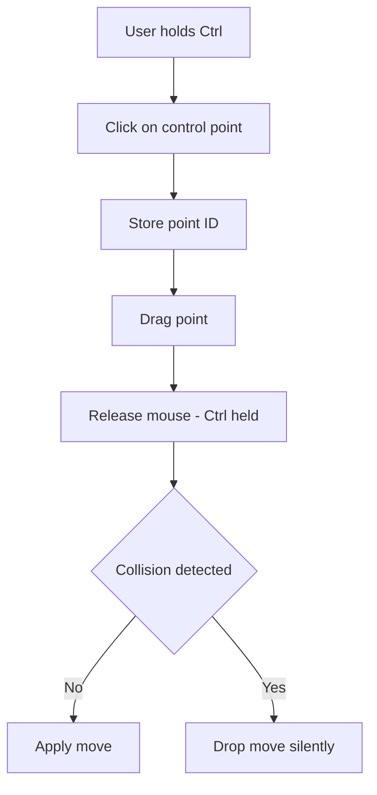

# Troubleshooting and Tips – Vorogui Interaction Problems

This section covers common issues when interacting with Vorogui’s point-and-click controller and offers solutions to ensure smooth parameter editing.

## Selecting and Moving Points

When you try to reposition a control point but nothing happens, it’s often due to the modifier-key sequence:

- **Press and hold Ctrl** before clicking on a point.
- **Click** to select the point to move.
- **Drag** to the desired location.
- **Release** the mouse button *while still holding* Ctrl to drop the point.

```c
// VOROGUI_OnLButtonDown (simplified)
if (wParam & MK_CONTROL) {
    int id = VOROGUI_GetNearestPointsetObject(...);
    if (id >= vorogui_numberofframepoints) {
        vorogui_idpointtobemoved = id;
    }
}

// VOROGUI_OnLButtonUp (simplified)
if ((wParam & MK_CONTROL) && vorogui_idpointtobemoved != -1) {
    // collision check & apply move...
    pPOINTSET->px[id] = xPos;
    pPOINTSET->py[id] = yPos;
    vorogui_idpointtobemoved = -1;
}
```

ℹ️ **Tip:** If you release Ctrl before dropping, Vorogui ignores the move request .

---

## Collision Detection: Dropped Moves

Vorogui enforces a minimum spacing between points. If the new position is too close to any existing point (within a 1.0-pixel threshold), the move is **silently rejected**:

```c
// Collision check in VOROGUI_OnLButtonUp
for (int i = 0; i < pPOINTSET->npts; i++) {
  if (abs(pPOINTSET->px[i] - xPos) < 1.0
   && abs(pPOINTSET->py[i] - yPos) < 1.0) {
    // drop move request
    vorogui_idpointtobemoved = -1;
    return;
  }
}
```

🚩 **Warning:** No error message is shown. Ensure you keep a clear gap between control points to avoid drops .

---

## Frame Points vs Control Points

Vorogui builds a boundary “frame” of fixed points around the mesh. These **frame points** are not linked to synth parameters:

| Point Type | controlratio | Behavior |
| --- | --- | --- |
| Frame Points | −1.0 | Non-controlling; ignored on clicks |
| Control Points | 0.0 … 1.0 | Mapped to synth parameters |


- Frame points are initialized with `controlratio = -1.0` .
- Only points with index ≥ `vorogui_numberofframepoints` respond to clicks and drags.

---

## Parameter Range Issues

Even if you correctly move a control point, you may hear no change if the associated synth parameter has a **zero range**:

```c
// In NewPointset: setting initial control ratios
if ((max - min) != 0.0)
  controlratio[i] = (value - min) / (max - min);
else
  controlratio[i] = 0.0;  // fixed value, no variation
```

🔑 **Key Point:** Parameters with identical `min` and `max` map all ratios to a constant value. Verify your synth definition uses non-zero ranges .

---

## Quick Reference

```plaintext
Select & Move Sequence:
1. Hold Ctrl  
2. Click on a control point  
3. Drag to new location  
4. Release mouse button (keep holding Ctrl)
```

| Symptom | Cause | Solution |
| --- | --- | --- |
| Point won’t move | Ctrl not held during release | Hold Ctrl for both click and release |
| No audible change from a move | Manipulated a frame point | Only move control points (index ≥ frame count) |
| Parameter seems stuck at one value | Synth parameter has zero range (`min == max`) | Define parameters with distinct `min` and `max` values |
| Move silently ignored | New position collides (within 1.0 pixels) | Keep the new point at least 1.0 units from its neighbors |


---

## Interaction Flow



This concise flow helps you visualize the exact sequence of events and decision points during a move operation.