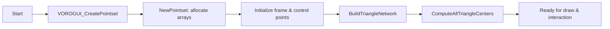

# Using the Vorogui Visual Controller – Concept: Pointsets and Voronoi-Based Control

The **Vorogui** visual controller represents synthesizer parameters as an interactive Voronoi diagram. Internally, it maintains a **POINTSET** of control points—some fixed as a border “frame”, others mapped to Tonic synth parameters. A Delaunay triangulation of these points underlies the Voronoi regions, enabling click-and-drag control of each parameter via the corresponding cell.

## POINTSET Structure 📐

The `POINTSET` holds all data needed for triangulation and Voronoi rendering:

| Field | Type | Description |
| --- | --- | --- |
| `int npts` | integer | Total number of points (frame + parameter points) |
| `double *px, *py` | array | X and Y coordinates of each point |
| `float *controlratio` | array | Normalized parameter value ∈ [0.0,1.0] (frame points use –1.0) |
| `int *vt[3], *nt[3]` | arrays | Triangle vertex indices (`vt`) and neighbor triangle indices (`nt`) for each triangle |
| `double *ctx, *cty` | arrays | Centers of each triangle (circumcenters) for Voronoi polygon construction |
| `double xmin,xmax,ymin,ymax` | doubles | Bounding rectangle updated on point moves |
| `long maxnumberofelements` | integer | Maximum capacity allocated |
| `char filename[255]` | string | Debug filename prefix |
| `double *pfStatistics` | array | Per-vertex statistics (Voronoi area, density, etc.) |
| … | … | (Additional color, vibration, and internal fields) |


Key internal allocation happens in `NewPointset`, which sets up all arrays based on `maxnumberofelements` .

## Creating a Pointset

To initialize control points and build the computational geometry:

```cpp
POINTSET* VOROGUI_CreatePointset(bool buildtinflag=true);
```

- **Frame points**: a ring along the window border with `controlratio = –1.0`.
- **Parameter points**: one per synth parameter; `controlratio` set from the current value normalized to [0,1].
- **Extent tracking**: computes `xmin/xmax/ymin/ymax` over all points.
- **Geometry build**: if `buildtinflag` is true, calls
- `BuildTriangleNetwork(pPOINTSET)`
- `ComputeAllTriangleCenters(pPOINTSET)`

…and readies the `POINTSET` for rendering and interaction .

## Delaunay Triangulation & Voronoi Generation

1. **NewPointset** allocates:
2. Triangle tables (`vt`, `nt`)
3. Triangle centers (`ctx`, `cty`)
4. Point arrays (`px`, `py`, `controlratio`)
5. **BuildTriangleNetwork** constructs a Delaunay triangulation over the point cloud.
6. **ComputeAllTriangleCenters** calculates each triangle’s circumcenter for polygon clipping.

This mesh underpins all neighbor queries and polygon slicing .



## Rendering the Voronoi Diagram

```cpp
void VOROGUI_DrawPointset(POINTSET* pPOINTSET, HDC hdc);
```

- **Pen/Brush setup**: red outlines; gray fill.
- **Per-cell rendering**: for each parameter point:
- Retrieve its `controlratio`.
- Obtain its Voronoi polygon via `VOROGUI_GetVoronoiPolygon`.
- 
- **Full fill** if `ratio==1.0`
- **Empty** if `ratio==0.0`
- **Sliced** by horizontal line at height `(1–ratio)` and flood-fill lower half .

## Interactive Control: Mouse Events

| Event | Handler | Behavior |
| --- | --- | --- |
| Left-click | `VOROGUI_OnLButtonDown` | Selects nearest parameter cell; computes new `controlratio` from Y position in cell |
| Left-drag (Ctrl) | `VOROGUI_OnLButtonUp` | Moves the selected point; rebuilds triangulation and centers on release |
| Right-click | `VOROGUI_OnRButtonUp` | Toggles display of parameter name labels |


Each handler uses `VOROGUI_GetNearestPointsetObject` to query the closest vertex via `FindNearestNeighbor` with adjustable adjacent-triangle flags.

## Querying Cells & Neighbors

- **Nearest point**:

```cpp
  int VOROGUI_GetNearestPointsetObject(POINTSET* p, double x, double y, int* seed);
```

wraps `FindNearestNeighbor` to select the best match, excluding frame points .

- **Voronoi polygon**:

```cpp
  bool VOROGUI_GetVoronoiPolygon(POINTSET* p, int vertex, POINT* outPoly, int* count);
```

extracts polygon vertices by clipping Delaunay triangles around the point.

- **Slice polygon**:

```cpp
  void VOROGUI_SlicePolygon(...);
```

intersects the polygon with a horizontal line to compute fill boundaries.

## Mapping to Synth Parameters

Points beyond the frame are in one-to-one correspondence with `global_pSynth->getParameters()`:

| Index Range | Role |
| --- | --- |
| `0 … frameCount–1` | Border frame (non-interactive) |
| `frameCount … npts–1` | Synth parameter controls |


On creation, each parameter point’s ratio is set by:

```cpp
controlratio[i] = (value – min) / (max – min);
```

where `value` is the current Tonic parameter .

```card
{
    "title": "Rebuild After Move",
    "content": "Always call BuildTriangleNetwork and ComputeAllTriangleCenters after moving points to update the Voronoi diagram."
}
```

---

By leveraging the **POINTSET** construct and Win32 GDI, Vorogui provides an intuitive, visually-rich controller for real-time parameter tweaking in the SpitonicControlSwitcherSynth application.