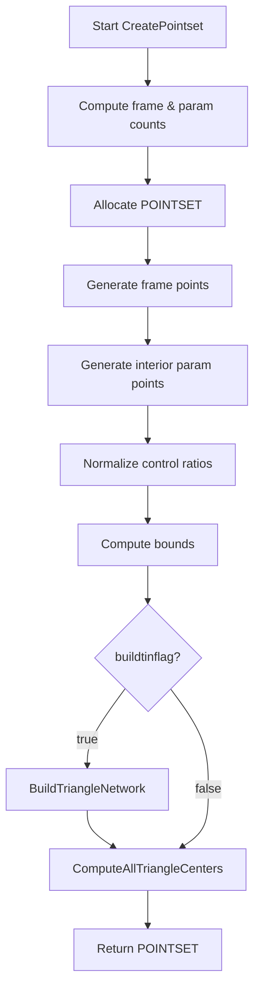

# Using the Vorogui Visual Controller – Creating and Initializing a Pointset

This section details how the Vorogui visual controller builds a spatial dataset (`POINTSET`) that drives the Voronoi‐based GUI. The `VOROGUI_CreatePointset` function allocates and populates a `POINTSET` with two kinds of points—border (“frame”) points and synth parameter points—then normalizes control values so the initial Vorogui display mirrors the synthesizer’s state .

## Function Signature

```cpp
POINTSET* VOROGUI_CreatePointset(bool buildtinflag = true);
```

- **buildtinflag**

When `true`, the function builds the triangulation network and computes all Voronoi cell centers before returning. If `false`, it skips these expensive steps, allowing later modification or loading from disk .

## Key Dependencies

- **global_pSynth**

A pointer to the active Tonic-based synthesizer. Provides control parameters via `getParameters()` .

- **global_xwidth**, **global_yheight**

Dimensions of the GUI drawing area (in pixels). Define the spatial bounds for frame and interior points .

- **NewPointset**

Allocates underlying arrays for `POINTSET` elements (from `c_pointset.cpp`).

- **BuildTriangleNetwork** & **ComputeAllTriangleCenters**

Construct the Delaunay triangulation and compute circumcenters used as Voronoi vertices .

## Initialization Workflow

Below is a high-level flow of the point‐set creation process:



## Detailed Steps

### 1. Compute Counts and Allocate

A fixed grid size `nx=20`, `ny=20` defines the number of border points:

- **Frame points** = `2*nx + 2*ny`
- **Parameter points** = `params.size()` where `params = global_pSynth->getParameters()`
- **Total elements** = sum of the above

```cpp
int nx = 20, ny = 20;
vorogui_numberofframepoints = 2*nx + 2*ny;
vector<ControlParameter> params = global_pSynth->getParameters();
vorogui_numberofpoints = params.size();
pPOINTSET = NewPointset(vorogui_numberofpoints + vorogui_numberofframepoints);
pPOINTSET->npts = 0;
```

### 2. Generate Frame (Border) Points

Four loops place points along each side, jittered by `rand_FloatRange(0.0,0.01)`. All frame points receive a `controlratio` of `-1.0` to distinguish them visually.

```cpp
float fxstep = (global_xwidth - 1)/float(nx);
for (int i = 0; i < nx; i++){
  pPOINTSET->px[pPOINTSET->npts] = i*fxstep + rand_FloatRange(0,0.01);
  pPOINTSET->py[pPOINTSET->npts] = rand_FloatRange(0,0.01);
  pPOINTSET->controlratio[pPOINTSET->npts++] = -1.0;
}
// (similar loops for right, top, and left edges)
```

### 3. Generate Interior Synth-Parameter Points

For each synth parameter, a point is placed randomly within an inset of 2 pixels to avoid border collisions. A simple collision check prevents overlapping points.

```cpp
for (int i = vorogui_numberofframepoints;
     i < vorogui_numberofpoints + vorogui_numberofframepoints; i++){
  pPOINTSET->px[i] = rand_FloatRange(2.0, global_xwidth - 2.0);
  pPOINTSET->py[i] = rand_FloatRange(2.0, global_yheight - 2.0);
  pPOINTSET->controlratio[i] = 0.0;
  // If too close to a previous point, retry by decrementing i
}
```

### 4. Normalize Control Ratios

Each parameter point’s `controlratio` is set to the normalized synth value:

| Expression | Meaning |
| --- | --- |
| `min = params[i].getMin()` | Synth parameter minimum |
| `max = params[i].getMax()` | Synth parameter maximum |
| `value = params[i].getValue()` | Current parameter value |
| `(value-min)/(max-min)` | Normalized [0,1] ratio |


```cpp
for (unsigned int i = 0; i < params.size(); i++){
  TonicFloat min   = params[i].getMin();
  TonicFloat max   = params[i].getMax();
  TonicFloat value = params[i].getValue();
  if ((max-min) != 0.0)
    pPOINTSET->controlratio[fp + i] = (value - min)/(max - min);
  else
    pPOINTSET->controlratio[fp + i] = 0.0;
}
```

### 5. Compute Spatial Bounds

Iterate all `npts` points to determine the axis-aligned bounding box (`xmin`, `xmax`, `ymin`, `ymax`).

```cpp
pPOINTSET->xmin = MAXDBL;  pPOINTSET->xmax = MINDBL;
pPOINTSET->ymin = MAXDBL;  pPOINTSET->ymax = MINDBL;
for (int i = 0; i < pPOINTSET->npts; i++){
  pPOINTSET->xmin = min(pPOINTSET->xmin, pPOINTSET->px[i]);
  // ... similarly for xmax, ymin, ymax
}
```

### 6. Build Triangulation & Voronoi Centers

If `buildtinflag` is `true`, construct the Delaunay triangulation and compute each triangle’s circumcenter, which serve as the Voronoi cell vertices.

```cpp
if (buildtinflag){
  BuildTriangleNetwork(pPOINTSET);
  ComputeAllTriangleCenters(pPOINTSET);
}
return pPOINTSET;
```

## Integration with Other Components

- **VOROGUI_ReadFromDisk**

Calls `VOROGUI_CreatePointset(false)`, then overrides point positions and ratios from a saved file before rebuilding the network .

- **Event Handlers**

Mouse events (`VOROGUI_OnLButtonDown/Up`, `VOROGUI_OnRButtonUp`) query or update `pPOINTSET`, then invoke `RedrawWindow` to reflect changes .

## Example Usage

```cpp
// Create and fully initialize the point set
POINTSET* pSet = VOROGUI_CreatePointset(true);

// Render in WM_PAINT handler
VOROGUI_DrawPointset(pSet, hdc);
```

## Best Practice

```card
{
    "title": "Build vs. Load",
    "content": "Pass buildtinflag=false when loading saved points to avoid redundant network rebuild."
}
```

*Happy Voronoi visualizing!*