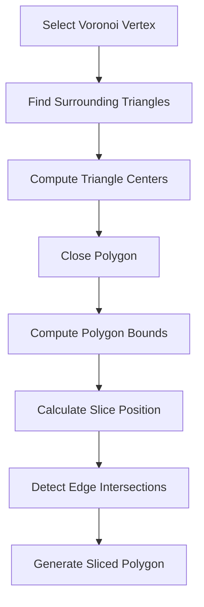

# Using the Vorogui Visual Controller – Voronoi Polygon Construction and Slicing

This section explains how Vorogui builds and slices Voronoi regions to visualize parameter levels. It covers three core operations:

- **Constructing** a Voronoi polygon around a point
- **Computing** its bounding values
- **Slicing** it horizontally according to a control ratio

These steps give users a clear fill‐level indication of each region.

---

## 1. Voronoi Polygon Construction

Vorogui creates each region by gathering adjacent Delaunay triangles around a data point and linking their centroids.

### VOROGUI_GetVoronoiPolygon

Retrieves the closed polygon surrounding a vertex.

| Signature | Purpose |
| --- | --- |
| `bool VOROGUI_GetVoronoiPolygon(POINTSET* pPOINTSET,`<br>` int ivertex,`<br>` POINT* pPointOutputPolygon,`<br>` int* p_numpointoutputpolygon)` | - Finds all valid triangles around `ivertex` using `FindAllValidTriSurroundingVertex`.<br>- Collects each triangle’s center (`ctx`, `cty`) into `pPointOutputPolygon`.<br>- Closes the loop by repeating the first point at the end.<br>- Returns the vertex count in `*p_numpointoutputpolygon`. |


```cpp
// Build Voronoi polygon from triangle centers
if (FindAllValidTriSurroundingVertex(pPOINTSET, ivertex, &vorogui_itriseed,
    &numtrifound, p_arraytri, &numneighborfound, p_arrayneighbor) == TRUE) {
  assert(numtrifound < 200);
  for (int j = 0; j < numtrifound; j++) {
    pPointOutputPolygon[j].x = pPOINTSET->ctx[p_arraytri[j]];
    pPointOutputPolygon[j].y = pPOINTSET->cty[p_arraytri[j]];
  }
  // Close polygon
  pPointOutputPolygon[numtrifound] = pPointOutputPolygon[0];
  *p_numpointoutputpolygon = numtrifound + 1;
  return TRUE;
}
*p_numpointoutputpolygon = 0;
return FALSE;
```

<!-- citation:  -->

---

## 2. Polygon Bounds Computation

Before slicing, Vorogui determines the polygon’s extents and the lowest vertex index.

### VOROGUI_GetPolygonMinMax

Scans vertices to find minimum/maximum X and Y values, plus the index of the lowest Y point.

| Signature | Purpose |
| --- | --- |
| `void VOROGUI_GetPolygonMinMax(POINT* pPointInputPolygon, int numpointinputpolygon,`<br>` long* p_xmin,`<br>` long* p_xmax,`<br>` long* p_ymin,`<br>` long* p_ymax,`<br>` int* p_idpointymin)` | - Initializes bounds to extreme values.<br>- Updates `*p_xmin`, `*p_xmax`, `*p_ymin`, `*p_ymax`.<br>- Tracks `*p_idpointymin` where Y is minimal. |


```cpp
*xmin = LONG_MAX; *xmax = LONG_MIN;
*ymin = LONG_MAX; *ymax = LONG_MIN;
*idpointymin = -1;
for (int i = 0; i < numpointinputpolygon; i++) {
  long x = pPointInputPolygon[i].x;
  long y = pPointInputPolygon[i].y;
  if (y < *ymin) { *ymin = y; *p_idpointymin = i; }
  if (y > *ymax) { *ymax = y; }
  if (x < *xmin) { *xmin = x; }
  if (x > *xmax) { *xmax = x; }
}
```

<!-- citation:  -->

---

## 3. Polygon Slicing

Vorogui slices each polygon at a horizontal level determined by a normalized control ratio (`dfValue` ∈ [0, 1]).

```card
{
    "title": "Control Ratio",
    "content": "dfValue must be between 0 and 1 inclusive."
}
```

### VOROGUI_SlicePolygon

Generates a sub‐polygon or intersection points for flood filling.

| Signature | Behavior |
| --- | --- |
| `void VOROGUI_SlicePolygon(POINT* pPointInputPolygon, int numpointinputpolygon, double dfValue,`<br>` POINT* pPointOutputPolygon,`<br>` int* p_numpointoutputpolygon)` | 1. **Full** (`dfValue == 1.0`) – copies input polygon.<br>2. **Empty** (`dfValue == 0.0`) – leaves `pPointOutputPolygon` empty.<br>3. **Partial** –<br>   a. Computes bounds via `VOROGUI_GetPolygonMinMax`.<br>   b. Defines a horizontal slice at `y = ymax - (ymax - ymin) * dfValue`.<br>   c. Iterates each polygon edge; uses `LineSegmentsIntersect` to find up to two intersection points.<br>   d. Outputs exactly two unique points in `pPointOutputPolygon`, count in `*p_numpointoutputpolygon`. |


```cpp
if (dfValue > 1.0) {
  ASSERT(FALSE);
  return;
} else if (dfValue == 1.0) {
  // Full polygon
  memcpy(pPointOutputPolygon, pPointInputPolygon,
         numpointinputpolygon * sizeof(POINT));
  *p_numpointoutputpolygon = numpointinputpolygon;
} else {
  long xmin, xmax, ymin, ymax; int idymin;
  VOROGUI_GetPolygonMinMax(pPointInputPolygon,
    numpointinputpolygon, &xmin, &xmax, &ymin, &ymax, &idymin);
  double yslice = ymax - (ymax - ymin) * dfValue;
  // Intersect each edge with (xmin, yslice)-(xmax, yslice)
  int numints = 0;
  for (int i = 0; i < numpointinputpolygon - 1; i++) {
    if (LineSegmentsIntersect(
      pPointInputPolygon[i].x, pPointInputPolygon[i].y,
      pPointInputPolygon[i+1].x, pPointInputPolygon[i+1].y,
      xmin, yslice, xmax, yslice,
      &pfX[numints], &pfY[numints]) == 1) {
      numints++;
      if (numints > 2) { /* skip duplicates */ }
    }
  }
  // Copy two unique intersections
  *p_numpointoutputpolygon = 0;
  for (int i = 0; i < numints; i++) {
    POINT pt = { (long)pfX[i], (long)pfY[i] };
    if (i == 0 ||
        (pt.x != pPointOutputPolygon[0].x ||
         pt.y != pPointOutputPolygon[0].y)) {
      pPointOutputPolygon[(*p_numpointoutputpolygon)++] = pt;
    }
  }
}
```

<!-- citation:  -->

---

## 4. Integration with Drawing

The drawing routine uses these functions to render filled and sliced Voronoi regions:

1. **Construct** the full polygon via `VOROGUI_GetVoronoiPolygon`.
2. **Draw** empty or full polygon for `dfValue` = 0 or 1.
3. **Slice** the polygon – return two points.
4. **Flood fill** the lower part using the intersection midpoint.

```cpp
// In VOROGUI_DrawPointset:
if (VOROGUI_GetVoronoiPolygon(...) == TRUE) {
  if (dfValue == 1.0) {
    Polygon(...);
  } else if (dfValue == 0.0) {
    HBRUSH hnullbrush = ...;
    Polygon(...);
    SelectObject(..., hnullbrush);
  } else {
    // Empty draw + slice
    Polygon(...); 
    POINT pts[2]; int n;
    VOROGUI_SlicePolygon(..., pts, &n);
    if (n == 2) {
      MoveToEx(..., pts[0]);
      LineTo(..., pts[1]);
      FloodFill(...);
    }
  }
}
```

This paints each Voronoi cell partially filled according to its synth parameter ratio.

---



---

By chaining **construction**, **bounding**, and **slicing**, Vorogui provides an intuitive, real‐time visual controller for audio parameters.