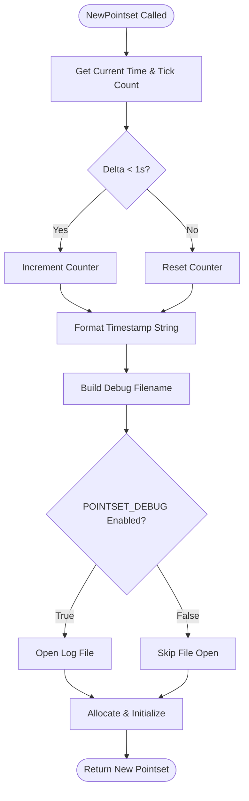

# Vorogui Pointset Engine Internals (Advanced) – Coordinate Transformations and Debugging

This section dives into the low-level mechanics of Vorogui’s **POINTSET** engine. You’ll learn how to uniformly **scale** or **translate** an entire point set, and how Vorogui timestamps and logs each new point set for **debugging** complex interactions or algorithmic issues.

---

## Coordinate Transformation Utilities

Vorogui provides two core utility functions to manipulate point‐set coordinates:

- **ScalePointset**: uniformly scales all points, triangle centers, and bounding box extents.
- **TranslatePointset**: shifts all points and triangle centers, then optionally applies a scale.

### ScalePointset

Uniformly multiplies every coordinate in the point set by the given scale factors.

```cpp
// Uniformly scale a point set in X and Y
void ScalePointset(POINTSET* pPointset, double x_scale = 1.0, double y_scale = 1.0) {
    if (!pPointset) {
        ASSERT(FALSE);
        return;
    }
    // Scale triangle centers
    for (int i = 0; i < pPointset->ntri; i++) {
        pPointset->ctx[i] *= x_scale;
        pPointset->cty[i] *= y_scale;
    }
    // Scale point coordinates
    for (int i = 0; i < pPointset->npts; i++) {
        pPointset->px[i] *= x_scale;
        pPointset->py[i] *= y_scale;
    }
    // Scale bounding box
    pPointset->xmin *= x_scale;
    pPointset->xmax *= x_scale;
    pPointset->ymin *= y_scale;
    pPointset->ymax *= y_scale;
}
```

**Key responsibilities**

- Scales `ctx`, `cty` (triangle centers) and `px`, `py` (point coords).
- Updates `xmin`, `xmax`, `ymin`, `ymax`.

### TranslatePointset

Shifts all coordinates by an **offset**, then applies optional **scaling**.

```cpp
// Translate and optionally scale a point set
void TranslatePointset(
  POINTSET* pPointset,
  double x_offset,
  double y_offset,
  double x_scale = 1.0,
  double y_scale = 1.0
) {
    if (!pPointset) {
        ASSERT(FALSE);
        return;
    }
    // Translate triangle centers
    for (int i = 0; i < pPointset->ntri; i++) {
        pPointset->ctx[i] += x_offset;
        pPointset->cty[i] += y_offset;
    }
    // Translate point coordinates
    for (int i = 0; i < pPointset->npts; i++) {
        pPointset->px[i] += x_offset;
        pPointset->py[i] += y_offset;
    }
    // Translate bounding box
    pPointset->xmin += x_offset;
    pPointset->xmax += x_offset;
    pPointset->ymin += y_offset;
    pPointset->ymax += y_offset;
    // Apply uniform scaling if requested
    if (x_scale != 1.0 || y_scale != 1.0) {
        ScalePointset(pPointset, x_scale, y_scale);
    }
}
```

**Key responsibilities**

- Translates `ctx`, `cty`, `px`, `py` and bounding box extents.
- Invokes **ScalePointset** when scale factors differ from 1.

### Utility Summary

| Function | Purpose | Parameters |
| --- | --- | --- |
| ScalePointset | Uniformly scale all coordinates and bounds | `x_scale`, `y_scale` |
| TranslatePointset | Shift then optionally scale all coordinates and bounds | `x_offset`, `y_offset`, `x_scale = 1.0`, `y_scale = 1.0` |


---

## Pointset Debugging Mechanism

Vorogui’s **NewPointset** constructor embeds a **timestamping** and **file-logging** mechanism. When **debug mode** is enabled, each new point set writes a log file named:

```plaintext
YYYYMonDD_HHMMSS_mmm_nnn_pointset_debug.txt
```

This helps trace point-set lifecycles across complex UI interactions or algorithm edits.

### NewPointset Constructor and Timestamping

Upon allocation, **NewPointset** records both the current system time and tick count:

```cpp
POINTSET* NewPointset(long maxnumberofelements) {
    // Allocate structure
    POINTSET* pPointset = (POINTSET*)malloc(sizeof(POINTSET));
    if (!pPointset) {
        printf("Allocation failed\n");
        return NULL;
    }

    // Time tracking
    CTime NowTime = CTime::GetCurrentTime();
    DWORD nowstamp_ms = GetTickCount();

    // Counter logic: reset if >1s, else increment
    if ((nowstamp_ms - prevnewpointsetstamp_ms) < 1000) {
        pointset_debug_filename_nnn++;
    } else {
        pointset_debug_filename_nnn = 0;
    }

    // Build filename prefix: YYYYMonDD_HHMMSS_
    CString prefixed = NowTime.Format(L"%Y%b%d_%H%M%S_");
    char buf[4];
    sprintf(buf, "%03d", pointset_debug_filename_nnn);
    prefixed += buf;
    prefixed += POINTSET_DEBUG_FILENAME;

    // Open debug file if enabled
    pPointset->pFILE_debug = NULL;
    if (POINTSET_DEBUG) {
        pPointset->pFILE_debug = _wfopen(prefixed.GetString(), L"w");
    }

    // Update previous time markers
    prevNewPointsetTimeStamp = NowTime;
    prevnewpointsetstamp_ms = nowstamp_ms;

    // … allocate arrays, initialize fields …
    return pPointset;
}
```

**Key points**

- `**prevNewPointsetTimeStamp**`, `**prevnewpointsetstamp_ms**`, and `**pointset_debug_filename_nnn**` are static globals reset or incremented on each call.
- Filename uses `**NowTime.Format("%Y%b%d_%H%M%S_")**` plus a 3-digit counter and `**POINTSET_DEBUG_FILENAME**`  `_pointset_debug.txt`.

### Debug Filename Convention ✨

| Segment | Description |
| --- | --- |
| `YYYY` | 4-digit year |
| `Mon` | Abbreviated month name |
| `DD` | Day of month (2 digits) |
| `HHMMSS` | Hour, minute, second (6 digits) |
| `mmm` | Milliseconds (3 digits) |
| `nnn` | Counter for sub-second calls (3 digits) |
| `_pointset_debug.txt` | Suffix defined by `POINTSET_DEBUG_FILENAME` |


This naming ensures **chronological ordering**, even when multiple point sets instantiate within the same millisecond.

### Enabling and Disabling Debugging

In **c_pointset.h**, debug logging is controlled by:

```c
// Define to 1 to enable time-stamped pointset logs
#define POINTSET_DEBUG_FILENAME "_pointset_debug.txt"
// Set to 1 for debug mode; default is 0 (production)
#define POINTSET_DEBUG 0
```

- Change `#define POINTSET_DEBUG 1` to activate logging.

### Lifecycle of Debug Files

When a point set is destroyed, its debug file (if open) is closed:

```cpp
void DeletePointset(POINTSET* pPointset) {
    // Close debug log if exists
    if (pPointset->pFILE_debug) {
        fclose(pPointset->pFILE_debug);
    }
    // … free all allocated arrays …
    free(pPointset);
}
```

This ensures clean teardown and prevents file handle leaks.

---

## Debug Flowchart

A high-level flow of **NewPointset**’s debug logic:



---

## Integration with Vorogui

- `**VOROGUI_CreatePointset**` calls `**NewPointset**`, inheriting this debug setup.
- Developers can trace point-set allocations, examine coordinate transformations, and correlate log entries with user actions or algorithmic events.
- In production builds, keep `POINTSET_DEBUG` disabled to avoid I/O overhead.

This detailed insight into coordinate transformations and debug internals empowers advanced customization and troubleshooting of Vorogui’s point-set engine.