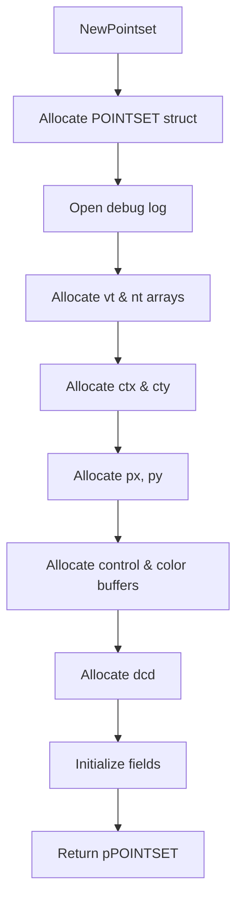

# Vorogui Pointset Engine Internals (Advanced)

This section dives into the **POINTSET** C structure, which underpins Vorogui’s spatial representation and statistics. You’ll learn about its fields, how memory is managed, and how statistics buffers integrate with the engine.

## POINTSET Structure Overview

The **POINTSET** structure aggregates all data needed for Voronoi-based rendering and control: point coordinates, triangle mesh, per-point statistics, and visual parameters .

### Core Spatial Fields

| Field | Type | Purpose |
| --- | --- | --- |
| **npts** | int | Current number of points in the set |
| **px**, **py** | double\* | Arrays of X/Y coordinates for each point |
| **dcd** | int\* | Integer flag per point (e.g., boundary codes) |
| **vt[3]** | int\* | Triangle vertex indices: three arrays of size  |
| **nt[3]** | int\* | Neighboring triangle indices per triangle |
| **ntri** | int | Total number of triangles |
| **ctx**, **cty** | double\* | Arrays of triangle center X/Y coordinates |


### Control & Visual Attributes 🎯

- **controlratio** (float\*): Normalized control value per point
- **vibrationangle** (float\*): Animation angle per point
- **color_r**, **color_g**, **color_b**, **color_a** (float\* each): RGBA color components

These arrays parallel **px/py**, enabling dynamic visual feedback .

### Bounding Box & Statistics

| Field | Type | Description |
| --- | --- | --- |
| **xmin**, **xmax**, **ymin**, **ymax** | double | Axis-aligned bounding rectangle of all points |
| **pGlobalStatisticsInfo** | GLOBALSTATISTICSINFO[ ] | Metadata (min, max, average) per statistics channel |
| **pfStatistics** | double\* | Contiguous buffer for per-point statistics values |
| **nStatPerPoint** | int | Number of statistics channels per point (+ extras) |
| **nSizeStatInByte** | int | Total byte size of the **pfStatistics** buffer |


Extras include automated Voronoi area/density channels .

---

## Memory Management 🛠️

Vorogui provides a suite of functions to allocate, resize, and free **POINTSET** data.

```c
OIFIILIB_API POINTSET* NewPointset(long maxnumberofelements);
OIFIILIB_API void    DeletePointset(POINTSET* pPointset);
OIFIILIB_API LONG    ReallocPointset(POINTSET* pPointset, long new_maxnumberofelements);
OIFIILIB_API LONG    NewPointsetStatistics(POINTSET* pPointset, long maxnumberofelements, long statperelement);
OIFIILIB_API LONG    ReallocPointsetStatistics(POINTSET* pPointset, long new_maxnumberofelements);
OIFIILIB_API void    DeletePointsetStatistics(POINTSET* pPointset);
OIFIILIB_API double* GetPointsetPointerToStatistics(POINTSET* pPointset, long ielement);
```

### 1. NewPointset

Allocates and initializes all arrays proportional to

`maxnumberofelements * POINTSET_NUMTRIANGLESOVERNUMPOINTS`:

- **Structure Allocation**
- **Debug Log**: opens `pFILE_debug` if `POINTSET_DEBUG` is enabled
- **Mesh Arrays**:
- `vt[0] = malloc(3 * max⋅N * sizeof(int))`
- `vt[1]`, `vt[2]` point into offsets of `vt[0]`
- `nt[0] = malloc(3 * max⋅N * sizeof(int))` similarly
- **Triangle Centers**:
- `ctx = malloc(max⋅N * sizeof(double))`
- `cty = malloc(max⋅N * sizeof(double))`
- **Point Coordinates**:
- `px = malloc(max * sizeof(double))`
- `py = malloc(max * sizeof(double))`
- **Visual/Control Buffers**:
- `controlratio`, `vibrationangle`, `color_r/g/b/a` via `malloc(max * sizeof(float))`
- **Auxiliary**: `dcd = malloc(max * sizeof(int))`
- **Initialization**:
- `npts = 0`, `ntri = 0`
- `xmin = MAXDBL`, `ymin = MAXDBL`, `xmax = MINDBL`, `ymax = MINDBL`
- `maxnumberofelements = max`
- `pfStatistics = NULL`, `nStatPerPoint = 0`, `nSizeStatInByte = 0`



### 2. DeletePointset

Frees resources in reverse order, ensuring no leaks:

- Closes **pFILE_debug** if open
- Frees: `dcd`, `controlratio`, `color_a/b/g/r`, `vibrationangle`, `py`, `px`, `cty`, `ctx`, `nt[0]`, `vt[0]`
- Calls `DeletePointsetStatistics` if **pfStatistics** exists
- Frees the POINTSET struct itself

### 3. ReallocPointset

Resizes all dynamic arrays via `realloc`, preserving data:

- `vt[0]`, `nt[0]` → new size: `3 * new_max * N * sizeof(int)`
- `ctx`, `cty` → `new_max * N * sizeof(double)`
- `px`, `py` → `new_max * sizeof(double)`
- `controlratio`, `vibrationangle`, `color_*`, `dcd` → `new_max * sizeof(...)`
- Updates `maxnumberofelements`

---

## Statistics Lifecycle

Vorogui supports per-point statistical computations (e.g., Voronoi areas, densities).

### NewPointsetStatistics

Allocates **pfStatistics**:

- Sets `nStatPerPoint = statperelement + POINTSET_EXTRA_NUMBEROFSTAT`
- Computes `nSizeStatInByte = sizeof(double) * max * nStatPerPoint * 2`

- `pfStatistics = malloc(nSizeStatInByte)`

### ReallocPointsetStatistics

Adjusts the statistics buffer when capacity changes:

- Recomputes `nSizeStatInByte = sizeof(double) * new_max * nStatPerPoint * 2`
- `pfStatistics = realloc(pfStatistics, nSizeStatInByte)`

### DeletePointsetStatistics

Safely frees the statistics buffer:

```c
free(pPointset->pfStatistics);
pPointset->pfStatistics = NULL;
```

### Accessing Statistics

```c
double* stats = GetPointsetPointerToStatistics(pPointset, ielement);
```

Returns a pointer to the first statistic channel for point index `ielement` .

---

## Integration with Vorogui

The UI layer invokes **NewPointset** through:

```c
POINTSET* VOROGUI_CreatePointset(bool buildtinflag);
```

which sets up initial points, builds the Delaunay mesh (`BuildTriangleNetwork`), and computes triangle centers (`ComputeAllTriangleCenters`) when `buildtinflag` is true .

---

**Key Takeaways**

🎯 The **POINTSET** engine balances raw mesh data with dynamic control and statistics arrays.

🛠️ Consistent allocation patterns (malloc/realloc/free) ensure flexibility for runtime resizing.

📈 Statistics buffers are optional and managed separately, doubling memory to support merge operations.