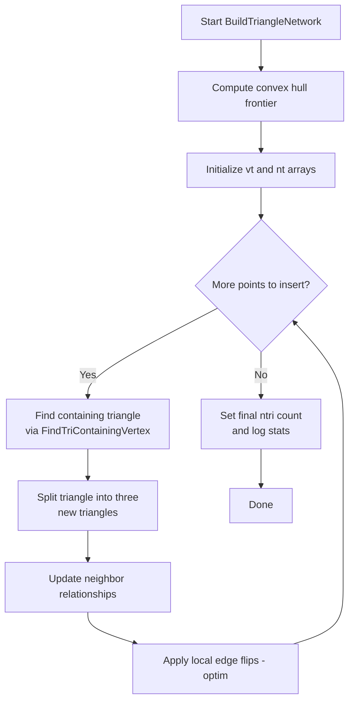
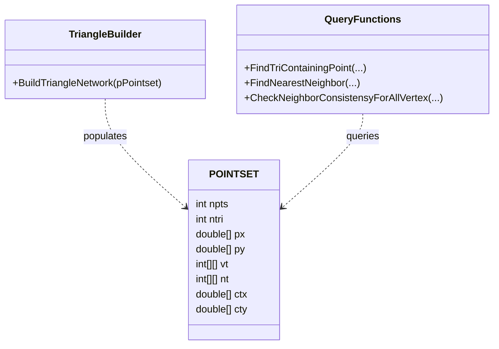

# Vorogui Pointset Engine Internals (Advanced) – Triangle Network Construction and Neighborhood Queries

This section dives into the core algorithms that power Vorogui’s spatial engine. You will learn how the pointset’s triangle network is built and how various query functions navigate and verify that network.

## 🏗️ BuildTriangleNetwork

BuildTriangleNetwork constructs an initial triangulation and optimizes it toward Delaunay. It populates each triangle’s **vertex table** (`vt`) and **neighbor table** (`nt`) in the `POINTSET` structure.

```cpp
void OIFIILIB_API BuildTriangleNetwork(POINTSET* pPointset);
```

### Process Flow



- **Convex hull frontier**: builds an initial border of triangles.
- **Point insertion**: for each new point:
- **Locate** containing triangle.
- **Split** it into three around the point.
- **Update** `vt`/`nt` tables.
- **Optimize** locally using edge-flip heuristics (`optim`) to enforce a Delaunay-like condition.
- **Finalize**: logs the number of triangles created and points rejected.

## 🔍 Neighborhood Query Functions

Once the triangle network exists, Vorogui offers spatial queries to locate triangles, find nearest vertices, and verify neighbor consistency.

| Function | Purpose | Key Parameters |
| --- | --- | --- |
| `FindTriContainingPoint` | Locate triangle containing (x,y) | `xa, ya, *p_itriseed` |
| `FindTriContainingPoint_CAT` | As above + collect all triangles on search path | adds `*p_numtrifound, *p_arraytri` |
| `FindTriContainingPoint_CATAV` | As CAT + collect encountered vertices | adds `*p_numvertexfound, *p_arrayvertex` |
| `FindNearestNeighbor` | Find closest point to (x,y) | `xa, ya, *p_itriseed, adjacenttriflag` |
| `CheckNeighborConsistensyForAllVertex` | Prune inconsistent neighbors after Voronoi calc. | `*pPointset` |
| `FindAllConsistentNeighborSurroundingVertex` | Get validated neighbor list around a vertex | `ivertex, *p_itriseed, *p_numneighborfound, *p_arrayneighbor` |


### FindTriContainingPoint

Finds the triangle that **contains** a query point by walking across neighbor links.

```cpp
int OIFIILIB_API FindTriContainingPoint(
  POINTSET* pPointset,
  double xa,
  double ya,
  int* p_itriseed
);
```

- **Inputs**
- `xa, ya`: coordinates of the query point.
- `p_itriseed[0]`: index of seed triangle to start search.
- **Outputs**
- Returns the triangle index if found.
- `-1` if the point lies outside the convex hull.
- `-2` if the point coincides with an existing vertex.
- Updates `p_itriseed[0]` to the last triangle tested.

### Variants: CAT & CATAV

These variants enhance the basic search by **collecting** the search path’s triangles and vertices.

```cpp
int FindTriContainingPoint_CAT(
  POINTSET* pPointset,
  double xa, double ya,
  int* p_itriseed,
  int* p_numtrifound,
  int* p_arraytri
);
```

```cpp
int FindTriContainingPoint_CATAV(
  POINTSET* pPointset,
  double xa, double ya,
  int* p_itriseed,
  int* p_numtrifound,
  int* p_arraytri,
  int* p_numvertexfound,
  int* p_arrayvertex
);
```

- **CAT**: returns `p_arraytri[0..p_numtrifound-1]`.
- **CATAV**: also fills `p_arrayvertex` with new vertices encountered.
- These helpers support **local retriangulation** and **Voronoi boundary** construction.

### FindNearestNeighbor

Computes the nearest vertex to a query point within the triangle network.

```cpp
int OIFIILIB_API FindNearestNeighbor(
  POINTSET* pPointset,
  double xa,
  double ya,
  int* p_itriseed,
  int adjacenttriflag = POINTSET_ADJACENTTRIFLAG_NOADJTRI
);
```

- **Basic behavior**
- Locates the containing triangle.
- Computes squared distances to its three vertices.
- Returns the closest one.
- `**adjacenttriflag**`
- `0`: restrict to current triangle.
- `1`: include one adjacent triangle.
- `3`: include all three adjacent triangles.
- **Bug fix context**
- Previous versions could miss a nearer vertex in an adjacent triangle. This flag corrects that.

### Consistency-Checking Functions

These functions prune neighbors that violate spatial consistency, crucial for accurate **averaging** or **segmentation**.

#### CheckNeighborConsistensyForAllVertex

```cpp
int OIFIILIB_API CheckNeighborConsistensyForAllVertex(
  POINTSET* pPointset
);
```

- Validates that each vertex’s neighbor list is coherent in **Voronoi area** and **shape**.
- Removes outliers too far from the subject vertex.

#### FindAllConsistentNeighborSurroundingVertex

```cpp
int OIFIILIB_API FindAllConsistentNeighborSurroundingVertex(
  POINTSET* pPointset,
  int ivertex,
  int* p_itriseed,
  int* p_numneighborfound,
  int* p_arrayneighbor
);
```

- Returns a **validated** list of neighbors for `ivertex`.
- Ensures full coverage around the vertex for Voronoi or averaging operations.

## Class Relationships



- **POINTSET** stores all geometry and connectivity data.
- **TriangleBuilder** module runs the network construction.
- **QueryFunctions** provide spatial searches and validation on that network.

---

These internal engines ensure Vorogui can respond interactively to user input, maintain spatial coherence, and support dynamic synthesizer-driven control via a robust, optimized triangulation.